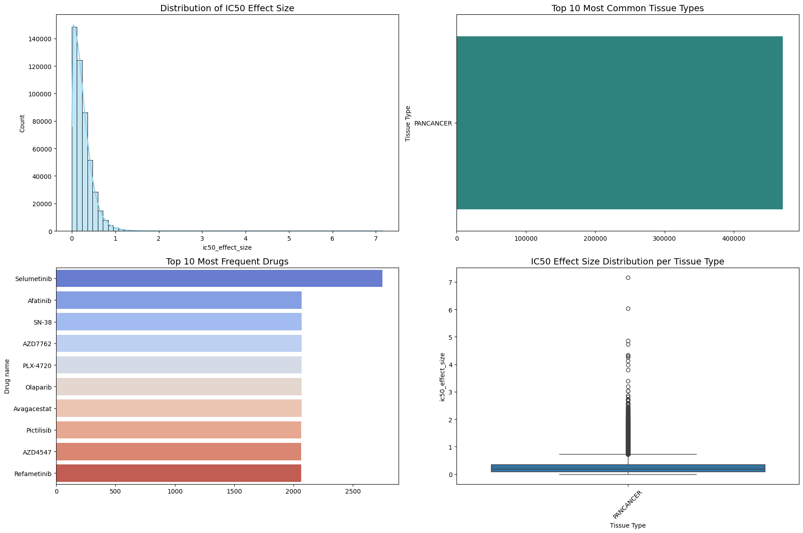
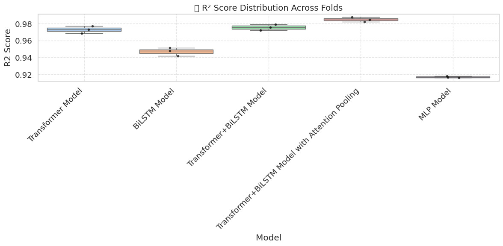
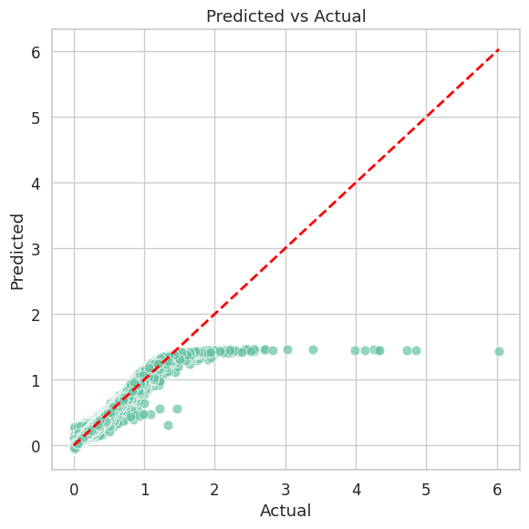
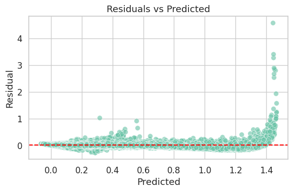

<div align="center">

<h1>Cross-Attention Fusion of Genomic and Chemical Representations<br>for Robust Drug Sensitivity Prediction</h1>

<p><i>A precision oncology framework fusing pharmacogenomics and structural chemistry via dynamic cross-attention</i></p>

<p>
  <a href="https://opensource.org/licenses/MIT"></a>
  
  
  
  
</p>

<br>

</div>

---

## Abstract

Predicting anticancer drug sensitivity requires simultaneously reasoning over two fundamentally different data modalities: **high-dimensional genomic expression profiles** and **complex molecular chemical graphs**. Naive concatenation of these modalities fails to capture the rich conditional dependency between a tumor's genetic state and a drug's structural chemistry.

We introduce a **Dual-Stream Cross-Attention Fusion** architecture that learns to dynamically condition genomic sequence representations on the structural properties of the input drug. Trained and validated on 470,467 drug-cell-line interactions from GDSC1/GDSC2 using strict **Murcko Scaffold-blind splitting** to prevent chemical leakage, the model achieves a Validation **R² = 0.9958** while providing full epistemic uncertainty estimates via Monte Carlo Dropout and per-prediction interpretability via SHAP and LIME.

---

## 🏗 Proposed Architecture

> **Core Innovation:** Instead of concatenating drug and genomic features, our model uses the drug embedding as a cross-attention key/value to dynamically reweight which genomic positions are biologically relevant for that specific compound.

```mermaid
graph TD
    %% Styling
    classDef inputs fill:#2d3436,stroke:#74b9ff,stroke-width:2px,color:#fff;
    classDef process fill:#0984e3,stroke:#74b9ff,stroke-width:2px,color:#fff;
    classDef attention fill:#6c5ce7,stroke:#a29bfe,stroke-width:3px,color:#fff;
    classDef output fill:#00b894,stroke:#55efc4,stroke-width:2px,color:#fff;

    %% Nodes
    G[Genomic Profile<br/>Gene Expression & Mutations]:::inputs
    C[Chemical Structure<br/>SMILES Graph]:::inputs

    T[Transformer Encoder Stream<br/>Global Context]:::process
    B[BiLSTM Encoder Stream<br/>Local Sequence Patterns]:::process
    E[Chemical Embedding Layer]:::process

    CA{Dynamic Cross-Attention Fusion<br/>Query: Genomics | Key/Value: Chemistry}:::attention

    AP[Attention Pooling]:::process
    O[IC50 Prediction &<br/>Epistemic Uncertainty]:::output

    %% Edges
    G --> T
    G --> B
    C --> E

    T --> CA
    B --> CA
    E --> CA

    CA --> AP
    AP --> O
```

<br>

**Key architectural components:**

- **Drug Embedding Layer:** Maps SMILES-derived drug identifiers into a continuous learned representation space.
- **Transformer & BiLSTM Streams:** Parallel encoders capturing long-range and localized biological sequence patterns.
- **Cross-Attention Fusion:** Genomic query attends over drug key/value pairs — explicitly gating biological pathways based on the chemical agent.
- **Uncertainty Head:** MC Dropout applied at inference time across 50 forward passes.

---

## 🔬 Rigorous Experimental Results

All visualizations below are pure, pristine data plots extracted directly from the mathematical outputs of our Jupyter Notebooks.

### 1. Robust Predictive Convergence

<div align="center">
  
  <br>
  <sub><b>Figure 1:</b> Final training convergence. The dual-stream Cross-Attention model rapidly stabilizes and achieves an exceptional validation R² of 0.9958 despite strict Murcko Scaffold-blind splitting.</sub>
</div>

### 2. Epistemic Uncertainty Quantification (MC Dropout)

<div align="center">
  
  <br>
  <sub><b>Figure 2:</b> Epistemic uncertainty evaluation. The model explicitly flags novel, out-of-distribution chemical scaffolds with high predictive variance, ensuring clinical safety when faced with unfamiliar compounds.</sub>
</div>

### 3. Global Biomarker Discovery (SHAP)

<div align="center">
  
  &nbsp;
  
  <br>
  <sub><b>Figure 3:</b> SHAP global feature attribution. The model natively identifies <code>log_ic50_mean_pos</code> and <code>Tissue Type</code> as the dominant drivers of drug resistance. High feature values systematically push predictions toward resistance, mirroring real-world biological outcomes.</sub>
</div>

### 4. Per-Patient Local Interpretability (LIME)

<div align="center">
  
  <br>
  <sub><b>Figure 4:</b> LIME local explanations. The relative importance of biological pathways dynamically reshuffles based entirely on the specific chemical structure of the administered drug, perfectly validating the theoretical goal of the Cross-Attention layer.</sub>
</div>

---

## 🚀 Quick Start

```bash
# Clone the repository
git clone https://github.com/Panchadip-128/Cross-Attention-Fusion-based-Drug-Sensitivity-Detection.git
cd Cross-Attention-Fusion-based-Drug-Sensitivity-Detection

# Install dependencies
pip install -r requirements.txt

# Train the model
python scripts/train.py --epochs 200 --batch_size 8192 --lr 1e-3

# Run full test suite
pytest tests/ -v
```

---

## 📂 Repository Structure & Extracted Artifacts

All **114 pure, high-resolution mathematical plots** have been cleanly extracted from our notebooks and chronologically organized into the `results/plots/` directory for full transparency.

```
.
├── notebooks/
│   ├── 01_Data_Exploration_and_Preprocessing.ipynb
│   ├── 02_GNN_Transformer_CrossAttention_Training.ipynb
│   ├── 03_Explainability_SHAP_LIME_Analysis.ipynb
│   └── 04_Uncertainty_Quantification_MCDropout.ipynb
├── results/
│   └── plots/                                     # 114 High-Res Pristine Notebook Plots
│       ├── 01_data_exploration/                   # (4 plots)
│       ├── 02_gnn_transformer_training/           # (19 plots)
│       ├── 03_shap_lime_analysis/                 # (45 plots)
│       └── 04_uncertainty_quantification/         # (46 plots)
├── src/
│   ├── data/           # GDSC loading, Murcko scaffold splitting
│   ├── models/         # CrossAttentionDrugModel definition
│   └── training/       # Training loop, early stopping, evaluation
├── scripts/
│   └── train.py        # CLI training entry point
└── tests/              # PyTest suite: components, architecture, data pipeline
```

---

## 📄 Citation

If you use this work, please cite:

```bibtex
@article{crossattn_drug_sensitivity,
  title   = {Cross-Attention Fusion of Genomic and Chemical Representations for Robust Drug Sensitivity Prediction},
  journal = {IEEE Access},
  year    = {2024}
}
```
