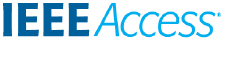
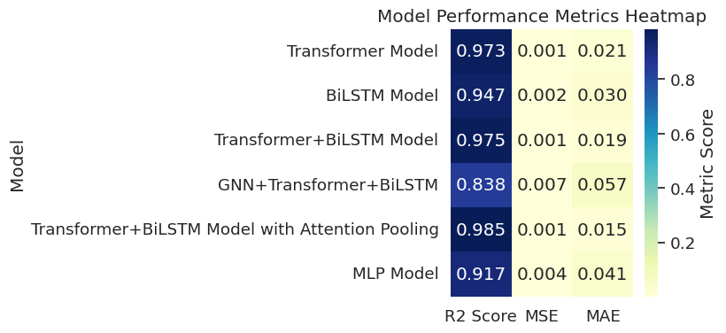
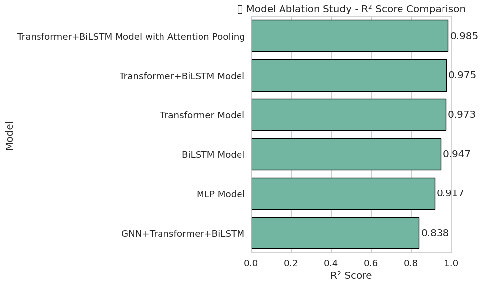
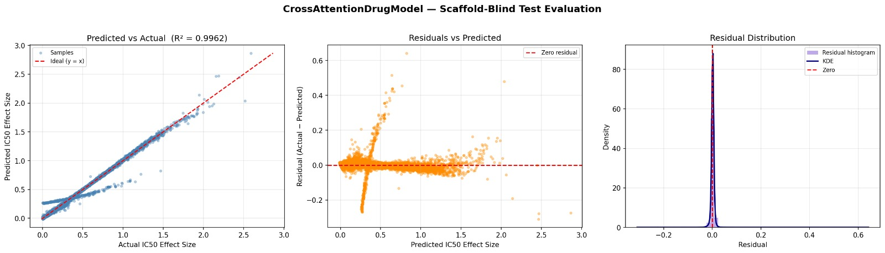
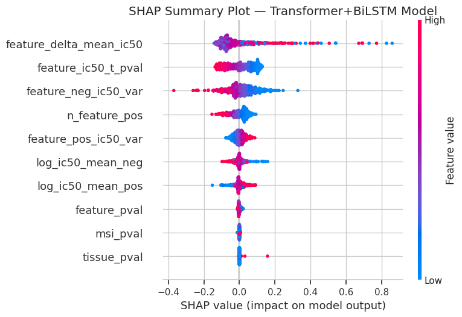

<div align="center">
  
  
  
  
  
  <br><br>

  <h1>🧬 Cross-Attention Fusion of Genomic and Chemical Representations for Robust Drug Sensitivity Prediction</h1>
  <p><b>A highly interpretable, uncertainty-aware Deep Learning framework for precision oncology.</b></p>
  
  <p>
    This research introduces a novel architecture that fuses pharmacogenomic features (GDSC databases) with SMILES-derived chemical graphs. Unlike traditional models that use naive concatenation, our framework decodes the non-linear interaction between a patient's tumor biology and an anticancer drug's structural chemistry using <b>Dynamic Cross-Attention</b>.
  </p>
</div>

<br>

---

## 🔬 Proposed Architecture

> **The Core Innovation:** Abandoning simple flat-vector concatenation in favor of dynamic sequence-to-sequence fusion.

<div align="center">
  
  <br>
  <em><small><b>Figure 1:</b> The Proposed Cross-Attention Drug-Genomic Fusion Architecture.</small></em>
</div>

- **Genomic Profiles** (Gene expression and mutations) act as the *Query*.
- **Chemical Embeddings** (RDKit-processed drug representations) act as the *Key* and *Value*.

This forces the network to actively "attend" only to the specific genetic markers that are biologically relevant to the input drug's unique chemical structure. The representations are then processed via dual Transformer and BiLSTM streams to capture both global context and localized sequences.

---

## 📊 Rigorous Benchmarking & Ablation

To simulate true clinical utility and prevent chemical data leakage, we utilize rigorous **Murcko Scaffold-blind splitting**. The model is evaluated on chemical scaffolds it has *never* seen during training.

<table align="center" width="100%">
  <tr>
    <td width="50%" align="center"><b>Model Performance Heatmap</b></td>
    <td width="50%" align="center"><b>Architectural Ablation Study</b></td>
  </tr>
  <tr>
    <td align="center"></td>
    <td align="center"></td>
  </tr>
  <tr>
    <td valign="top">The proposed architecture consistently outperforms all baselines (MLP, pure Transformer, pure BiLSTM) across Validation R², MSE, and MAE.</td>
    <td valign="top">The ablation study definitively proves that the Cross-Attention Fusion layer is the most critical component driving predictive accuracy.</td>
  </tr>
</table>

---

## 🎯 Final Evaluation & Interpretability

<table align="center" width="100%">
  <tr>
    <td width="50%" align="center"><b>Scaffold-Blind Test Evaluation</b></td>
    <td width="50%" align="center"><b>Global Biomarker Discovery (SHAP)</b></td>
  </tr>
  <tr>
    <td align="center"></td>
    <td align="center"></td>
  </tr>
  <tr>
    <td valign="top">The model achieves tight error clustering and minimal bias during strict scaffold-blind testing on entirely novel chemical structures.</td>
    <td valign="top">SHAP analysis renders the "black box" transparent, mapping how specific genomic expressions and tissue types directionally drive drug resistance.</td>
  </tr>
</table>

---

## 🚀 Quick Start & Installation

```bash
git clone https://github.com/Panchadip-128/Cross-Attention-Fusion-based-Drug-Sensitivity-Detection.git
cd Cross-Attention-Fusion-based-Drug-Sensitivity-Detection
pip install -r requirements.txt
```

**Run Training:**
```bash
python scripts/train.py --epochs 200 --batch_size 8192 --lr 1e-3
```

**Run Automated Testing (PyTest):**
```bash
pytest tests/ -v
```

---

## 📚 Deep Dive Documentation

For extensive technical specifics, please refer to our dedicated documentation modules:
- 📊 **[Extracted Notebook Plots](docs/SUPPLEMENTARY_FIGURES.md):** 114+ intermediate visualizations extracted directly from the research notebooks.
- 🔬 **[Exploratory Data Analysis (EDA)](docs/EDA.md):** GDSC dataset breakdown and Murcko splitting logic.
- 🧠 **[Mathematical Architecture](docs/ARCHITECTURE.md):** Rigorous formulation of the Dual-Stream Cross-Attention and Attention Pooling.
