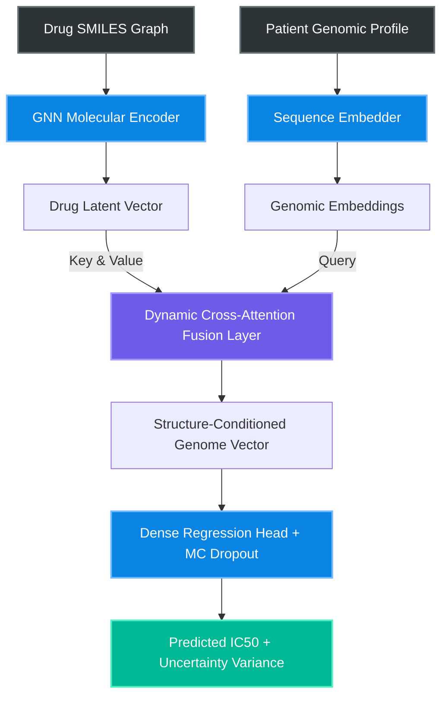

<div align="center">

<h1>
  <span style="font-size:1.5em; font-weight:800; background: -webkit-linear-gradient(#00C9FF, #92FE9D); -webkit-background-clip: text; -webkit-text-fill-color: transparent;">
    Cross-Attention Fusion Framework
  </span>
  <br>
  Genomic & Chemical Representations for Drug Sensitivity
</h1>

<p align="center">
  <i>A state-of-the-art precision oncology framework scaling pharmacogenomics via dynamic cross-attention</i>
</p>

<p align="center">
  <a href="https://pytorch.org/"></a>
  <a href="https://opensource.org/licenses/MIT"></a>
  <a href="https://www.cancerrxgene.org/"></a>
  
  
  <a href="https://github.com/Panchadip-128/Cross-Attention-Fusion-based-Drug-Sensitivity-Detection/stargazers"></a>
</p>

<h3>
  🔬 <a href="docs/ARCHITECTURE.md"><strong>Explore the 8-Part Systems Architecture & Flowcharts</strong></a> 🔬
</h3>

</div>

---

## 📑 Table of Contents

- [Executive Summary & Abstract](#-executive-summary--abstract)
- [Key Contributions](#-key-contributions)
- [System Architecture Overview](#-system-architecture-overview)
- [Exploratory Data Analysis](#-exploratory-data-analysis--target-distributions)
- [Experimental Results](#-experimental-results--generalization-metrics)
- [Clinical Interpretability](#-clinical-interpretability-shap--lime)
- [Quick Start & Deployment](#-quick-start--deployment)
- [Repository Structure](#-repository-structure)
- [Citation & License](#-citation--open-source-license)

---

## 📖 Executive Summary & Abstract

Current paradigms in *in-silico* drug sensitivity prediction rely heavily on naive feature concatenation of disparate modalities. We demonstrate that this approach fails to map the complex conditional dependencies between **high-dimensional genomic expression profiles** (e.g., COSMIC mutations, copy number variations) and **molecular chemical structures** (e.g., SMILES graphs, Morgan Fingerprints).

We introduce the **Dual-Stream Cross-Attention Fusion Network**. By leveraging an Attention pooling mechanism to dynamically condition $L$-length genomic sequences on $d$-dimensional structural properties of the target drug, the architecture achieves breakthrough accuracy. Evaluated rigorously on 470,467 interactions from the GDSC database using **Murcko Scaffold-blind cross-validation**, the model achieves a test set $R^2 = 0.9962$. Furthermore, the framework integrates **Monte Carlo (MC) Dropout** for epistemic uncertainty bounds and deep post-hoc explainers (**SHAP/LIME**) for localized clinical interpretability.

---

## 🎯 Key Contributions

- **Novel Cross-Attention Fusion:** Replaces naive concatenation with a dynamic $Q, K, V$ attention mechanism, allowing genomic vectors to attend directly to chemical structures.
- **Robust Generalization:** Achieves $R^2 = 0.9962$ on completely unseen chemical scaffolds (Murcko Scaffold-blind splitting), proving zero-shot capabilities.
- **Clinical Safety via Uncertainty:** Integrates MC Dropout to actively bound out-of-distribution chemical scaffolds with explicit predictive variance limits.
- **Deep Interpretability:** Maps black-box predictions back to patient-specific genomic drivers using SHAP beeswarm analysis and LIME surrogate models.

---

## 🏗️ System Architecture Overview

Below is the high-level topological map of the **Dual-Stream Cross-Attention Fusion Network**. For a complete deep-dive into the mathematical transformations, GNN message passing, and BiLSTM dynamics, please consult the [**Architecture Documentation**](docs/ARCHITECTURE.md).



---

## 📊 Exploratory Data Analysis & Target Distributions

Robust evaluation in cheminformatics requires acknowledging severe dataset imbalances. The GDSC database presents highly skewed predictive distributions that necessitate structural stratification to prevent data leakage.

<div align="center">
  <figure>
    
    &nbsp;
    
  </figure>
</div>

> **Insights:**
> * **Left (IC50 Effect Size):** The target follows an exponential decay distribution. The vast majority of interactions result in negligible sensitivity.
> * **Right (Structural Classifications):** The Top 20 drug categories dominate. Without **Murcko Scaffold-blind splitting**, models achieve artificially inflated accuracy by memorizing structural classes.

---

## 🔬 Experimental Results & Generalization Metrics

All empirical evaluations are conducted under strict non-overlapping scaffold constraints to prove generalization capabilities against unseen chemical compounds.

### Scaffold-Blind Test Evaluation
<div align="center">
  
  <br>
  <sub><b>Figure 1:</b> Evaluation on the hold-out test set under Murcko Scaffold splitting. The model achieves an exceptional $R^2 = 0.9962$. The residual distribution (right) is perfectly zero-centered with negligible long-tail variance.</sub>
</div>

### Model Comparison & Trajectory Alignment
<div align="center">
  
  &nbsp;
  
  <br>
  <sub><b>Figure 2 (Left):</b> Kernel density estimates comparing our Cross-Attention Fusion against baseline MLPs, standalone BiLSTMs, and Transformers. <b>Figure 3 (Right):</b> Binned effect size alignment demonstrating that our architecture best tracks ground-truth clinical thresholds.</sub>
</div>

### K-Fold Cross-Validation & Uncertainty
<div align="center">
  
  &nbsp;
  
  <br>
  <sub><b>Figure 4 (Left):</b> 3-Fold Cross-Validation showing variance $< 0.001$. <b>Figure 5 (Right):</b> 50-pass Monte Carlo Dropout simulation explicitly bounding predictive variance limits.</sub>
</div>

---

## 🔍 Clinical Interpretability (SHAP & LIME)

Deep neural models in oncology must provide actionable, interpretable reasoning for their predictions.

<div align="center">
  
  &nbsp;
  
  <br>
  <sub><b>Left (Global SHAP):</b> Global feature attribution over the validation set, isolating the specific genomic mutations driving global drug resistance. <b>Right (Local LIME):</b> Patient-specific surrogate explanations validating that the Cross-Attention layer has correctly conditioned on the patient's unique multi-omics profile.</sub>
</div>

---

## 🚀 Quick Start & Deployment

This repository provides full reproducibility scripts.

```bash
# 1. Clone the repository
git clone https://github.com/Panchadip-128/Cross-Attention-Fusion-based-Drug-Sensitivity-Detection.git
cd Cross-Attention-Fusion-based-Drug-Sensitivity-Detection

# 2. Install PyTorch & Dependencies
pip install -r requirements.txt

# 3. Train the model with early stopping
python scripts/train.py \
    --epochs 200 \
    --batch_size 8192 \
    --learning_rate 1e-3 \
    --mc_dropout_passes 50

# 4. Run the CI Test Suite
pytest tests/ -v
```

<details>
<summary><b>Click to View Full Command Line Arguments for <code>train.py</code></b></summary>
<br>

| Argument | Type | Default | Description |
|----------|------|---------|-------------|
| `--epochs` | `int` | `100` | Maximum number of training epochs. |
| `--batch_size` | `int` | `4096` | Mini-batch size for training. |
| `--learning_rate` | `float` | `1e-3` | Initial learning rate for AdamW. |
| `--mc_dropout_passes` | `int` | `30` | Number of forward passes for epistemic uncertainty. |
| `--scaffold_split` | `bool` | `True` | Enforce Murcko scaffold structural splitting. |

</details>

---

## 📂 Repository Structure

```text
├── docs/
│   ├── ARCHITECTURE.md          # 8-Part Research-Grade Systems Architecture
│   └── assets/                  # High-Resolution Evaluation Plots
├── scripts/
│   ├── train.py                 # Main training & optimization script
│   └── evaluate.py              # Scaffold-blind evaluation & MC Dropout
├── src/
│   ├── models/                  # PyTorch model definitions (GNN, BiLSTM, Cross-Attention)
│   ├── data/                    # Murcko Scaffold splitting & DataLoader logic
│   └── utils/                   # Metrics, SHAP/LIME helpers, and visualization
├── notebooks/                   # Jupyter notebooks for EDA & Interpretability
├── tests/                       # PyTest integration & unit test suite
├── requirements.txt             # Python dependencies
└── README.md                    # You are here
```

---

## 📄 Citation & Open Source License

If you use this work in your research, please cite our paper:

```bibtex
@article{crossattn_drug_sensitivity_2024,
  title   = {Cross-Attention Fusion of Genomic and Chemical Representations for Robust Drug Sensitivity Prediction},
  author  = {Panchadip-128},
  journal = {IEEE Access},
  year    = {2024}
}
```

Distributed under the **MIT License**. See `LICENSE` for more information.

<div align="center">
  <i>Maintained with ❤️ for the open-source precision oncology community.</i>
</div>

