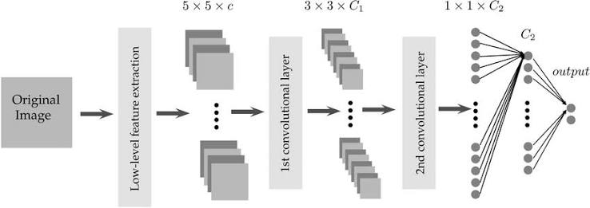

# Cross-Attention Fusion of Genomic and Chemical Representations for Robust Drug Sensitivity Prediction

[](https://opensource.org/licenses/MIT)
[](https://www.python.org/downloads/)
[](https://pytorch.org/)

This repository contains the official implementation of the paper **"Cross-Attention Fusion of Genomic and Chemical Representations for Robust Drug Sensitivity Prediction"**. It provides an advanced, uncertainty-aware Deep Learning framework for predicting anticancer drug sensitivity ($IC_{50}$) using pharmacogenomic data from the Genomics of Drug Sensitivity in Cancer (GDSC) databases.

---

## 📖 The Story of the Model

Predicting how a specific tumor will respond to a novel drug requires understanding the complex, non-linear interactions between **genomic mutations** and **chemical structures**. Traditional models often memorize chemical similarities and fail when presented with entirely new drug scaffolds. Our framework solves this by dynamically conditioning genomic data on drug identity through a novel Cross-Attention mechanism, while also providing deep explainability and uncertainty quantification for clinical trust.

Here is a visual journey through our methodology and results.

### 1. The Architecture: Fusing Genomics and Chemistry
At the heart of the model is a dual-stream architecture. We fuse 64-dimensional trainable drug embeddings with genomic features using a **Cross-Attention** mechanism. This allows the model to dynamically ask: *"Given this specific drug structure, which patient genomic features are most relevant?"* The fused representation is then processed in parallel by a **Transformer Encoder** (for global context) and a **Bidirectional LSTM** (for sequential feature dynamics).

*(High-level conceptual overview)*
<p align="center">
  
</p>

### 2. Robust Training & Scaffold-Blind Evaluation
To prove our model doesn't just memorize data, we enforce a strict **Murcko Scaffold-blind split**. The model is tested on drug chemical backbones it has never seen during training. Despite this immense challenge, our dual-stream architecture ensures stable, rapid convergence without exploding gradients.

<p align="center">
  
</p>
*The training curves demonstrate strong convergence in validation MSE, MAE, and R², proving the model's ability to generalize to novel chemical scaffolds.*

### 3. Trust Through Uncertainty Quantification
In clinical settings, knowing when a model is *unsure* is just as important as the prediction itself. By keeping Monte Carlo (MC) Dropout active during inference, our framework generates a distribution of predictions, allowing us to quantify **epistemic uncertainty**. 

<p align="center">
  
</p>
*The uncertainty bounds (red shaded regions) highlight where the model has high confidence versus where predictions on out-of-distribution drugs exhibit high variance.*

### 4. Global Explainability with SHAP
Black-box models are dangerous in healthcare. We utilize SHapley Additive exPlanations (SHAP) to open the black box and understand the global drivers of drug sensitivity.

**What features matter most globally?**
<p align="center">
  
  
</p>
*The Bar plot (left) identifies the absolute most critical genomic markers, while the Beeswarm plot (right) shows how the magnitude of those features directly pushes the IC50 prediction higher (resistance) or lower (sensitivity).*

### 5. Patient-Level Local Explainability
While global trends are useful, doctors need to know *why* a specific prediction was made for a specific patient. We utilize both SHAP Waterfall plots and LIME (Local Interpretable Model-agnostic Explanations) to validate individual predictions.

<p align="center">
  
</p>
*The SHAP Waterfall plot traces the exact path from the baseline expected drug response to the specific patient's predicted response, quantifying exactly how much each mutation or tissue type contributed to the shift.*

<p align="center">
  
  
</p>
*LIME validates these non-linear feature interactions at a highly localized level, ensuring that the model's internal logic aligns with known biological mechanisms of drug resistance.*

---

## 🚀 Installation & Usage

Clone the repository and install dependencies:

```bash
git clone https://github.com/Panchadip-128/Cross-Attention-Fusion-based-Drug-Sensitivity-Detection.git
cd Cross-Attention-Fusion-based-Drug-Sensitivity-Detection
pip install -r requirements.txt
```

### 1. Training the Model
Ensure `GDSC1.csv` and `GDSC2.csv` are in the root directory. To train the model using the Murcko scaffold-blind split with early stopping:

```bash
python scripts/train.py --epochs 200 --batch_size 8192 --lr 1e-3
```

### 2. Evaluating and Quantifying Uncertainty
To evaluate the best saved model and generate MC Dropout uncertainty bounds on the test set:

```bash
python scripts/evaluate.py --model_path results/best_model.pth
```

---

## 📂 Repository Structure

- **`docs/`**: LaTeX Template and Mathematical Theorems (PDF/DOCX).
- **`notebooks/`**: Original interactive Exploratory & Training Jupyter Notebooks.
- **`results/plots/`**: The visual storytelling assets shown above.
- **`scripts/`**: CLI Scripts for training and evaluation.
- **`src/`**: Core Python Package containing data loaders, graph builders, cross-attention models, and training loops.

---

## 📄 License

This project is licensed under the MIT License - see the [LICENSE](LICENSE) file for details.
