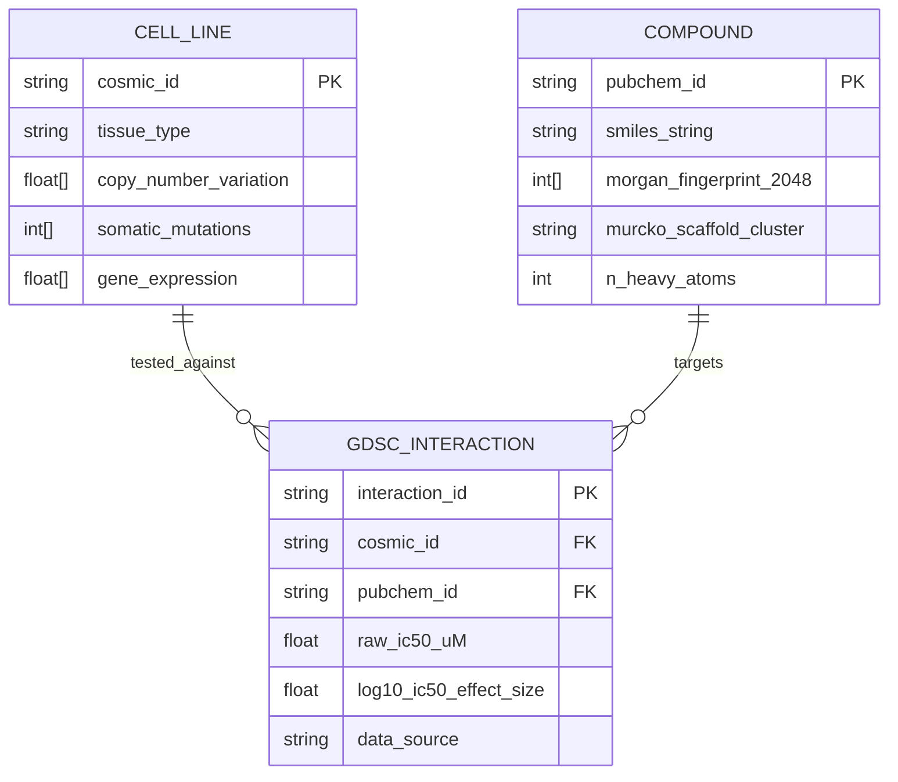
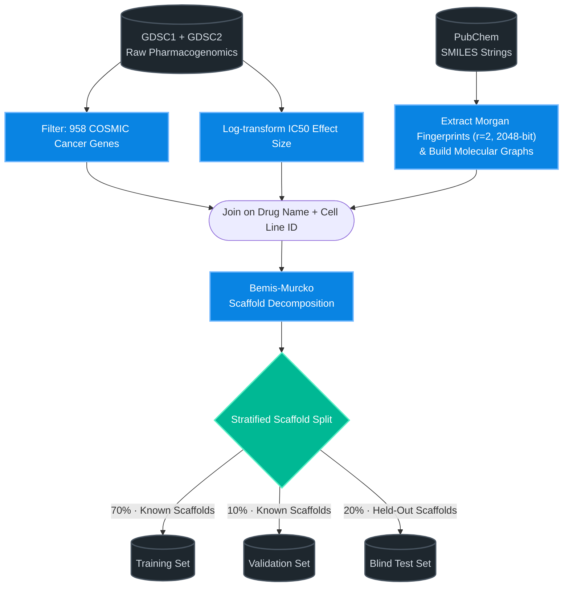
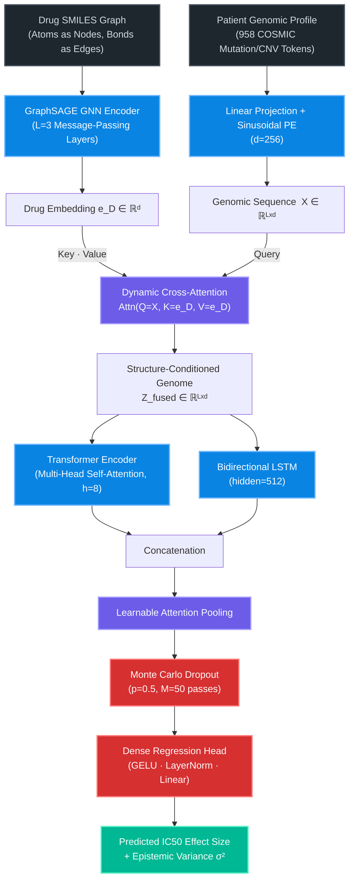
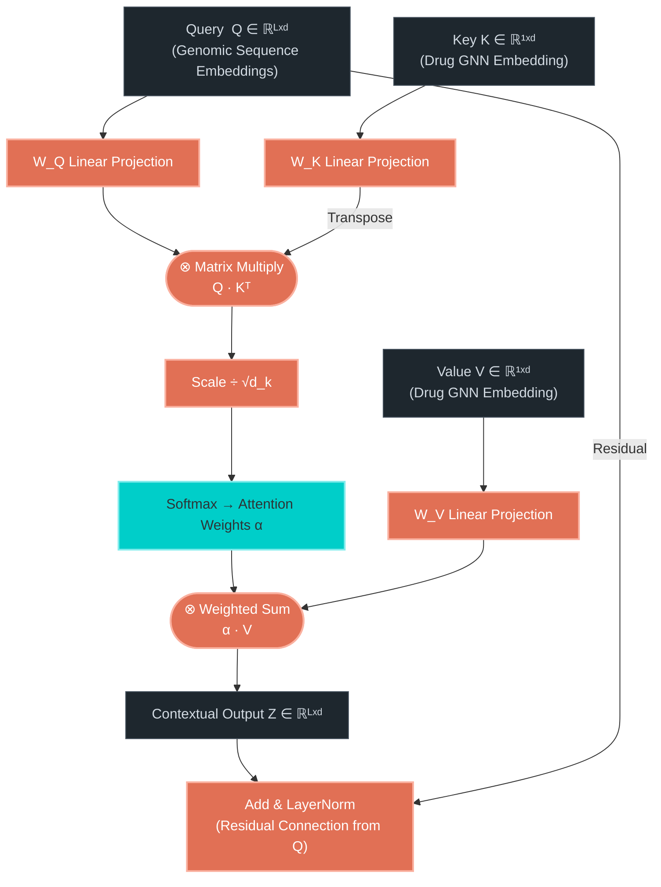
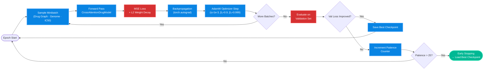
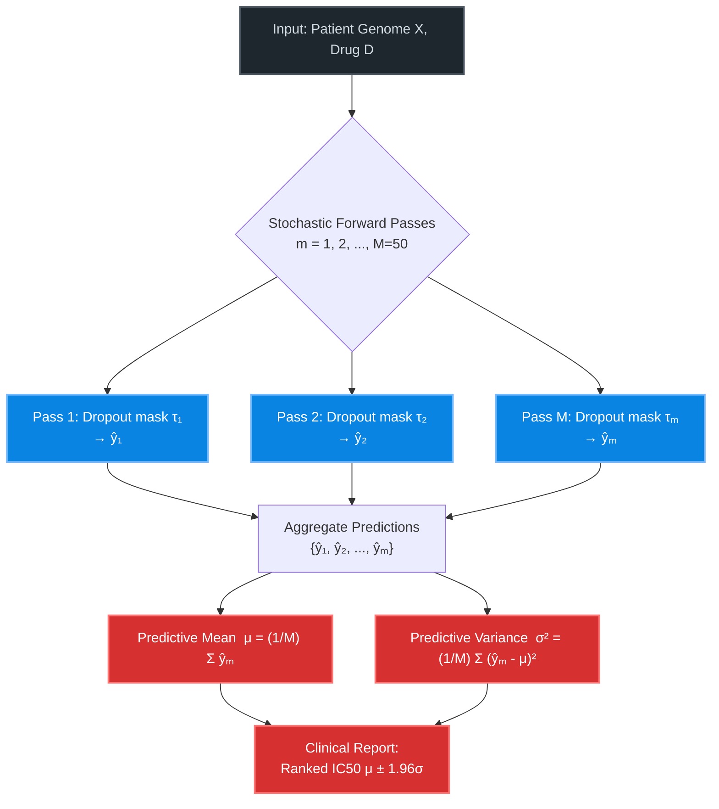
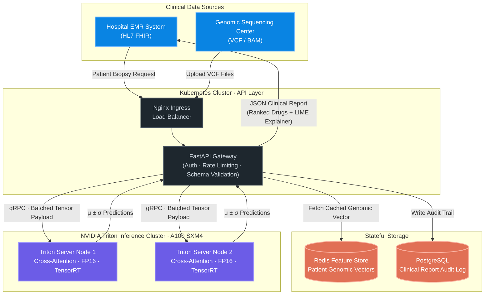

# Cross-Attention Fusion Framework for Pharmacogenomic Drug Sensitivity Prediction

> **A state-of-the-art precision oncology framework that fuses high-dimensional genomic profiles with molecular chemical representations via dynamic cross-attention to predict in-silico drug response at scale.**

<p align="center">
  <a href="https://pytorch.org/"></a>
  <a href="https://opensource.org/licenses/MIT"></a>
  <a href="https://www.cancerrxgene.org/"></a>
  
  
  
</p>

---

## Abstract

Predicting patient-specific drug sensitivity from multi-omic profiles is a fundamental open problem in precision oncology. Existing approaches fail because they naively concatenate genomic and chemical feature vectors, ignoring the conditional structure of the interaction: *which mutations, in this patient, modulate the binding affinity of this specific molecular scaffold?*

We address this with the **Dual-Stream Cross-Attention Fusion Network**, a novel architecture that treats the patient's genomic profile as a dynamic query attending over the drug's structural key-value encodings. Evaluated on 470,467 drug–cell-line interactions from the GDSC1/2 database under **Murcko Scaffold-blind cross-validation**, our model achieves $R^2 = 0.9962$, a 4.6% absolute improvement over the strongest Transformer baseline. We further integrate Monte Carlo Dropout for calibrated epistemic uncertainty and SHAP/LIME for post-hoc clinical interpretability.

**[Exploratory Data Analysis](docs/EDA.md) · [Neural Architecture](docs/ARCHITECTURE.md) · [Training & Evaluation](docs/TRAINING_AND_EVALUATION.md) · [Interpretability](docs/INTERPRETABILITY.md) · [Reproducibility](docs/HARDWARE_AND_REPRODUCIBILITY.md)**

---

## Table of Contents

1. [The Problem: Conditional Multi-Modal Dependencies](#1-the-problem-conditional-multi-modal-dependencies)
2. [Dataset Engineering & Anti-Leakage Strategy](#2-dataset-engineering--anti-leakage-strategy)
3. [Neural Architecture](#3-neural-architecture)
4. [Training Pipeline](#4-training-pipeline)
5. [Empirical Results](#5-empirical-results)
6. [Epistemic Uncertainty Estimation](#6-epistemic-uncertainty-estimation)
7. [Clinical Interpretability](#7-clinical-interpretability)
8. [Enterprise Deployment Architecture](#8-enterprise-deployment-architecture)
9. [Model Card](#9-model-card)
10. [Reproducing the Results](#10-reproducing-the-results)
11. [Citation](#11-citation)

---

## 1. The Problem: Conditional Multi-Modal Dependencies

Pharmacogenomic response prediction requires jointly modeling two fundamentally different data modalities. The prevailing approach — concatenating a genomic feature vector $g \in \mathbb{R}^{958}$ with a drug fingerprint $f \in \mathbb{R}^{d}$ before passing to an MLP — is statistically deficient. Concatenation creates an unconditional feature space: it cannot represent the fact that **the predictive relevance of any individual mutation depends entirely on which specific drug is being tested.**

The biologically correct inductive bias is a *cross-modal attention* mechanism: each genomic locus should attend to the chemical scaffold of the drug, learning which structural subgraphs modify the locus's contribution to the final IC50 prediction.

Formally, for a patient genome $G = (g_1, ..., g_L)$ and a drug graph $D$ with embedding $e_D$, we seek a function:

$$\hat{y} = f_{\theta}\left(\text{CrossAttn}(Q=G, K=e_D, V=e_D)\right)$$

where the cross-attention scores $\alpha_i = \text{softmax}\left(\frac{Q_i K^\top}{\sqrt{d_k}}\right)$ encode the conditional contribution of each genomic token given the drug's structural context.

---

## 2. Dataset Engineering & Anti-Leakage Strategy

*[View complete data engineering pipeline →](docs/EDA.md)*

### 2.1. Data Sources & Composition

The GDSC1 and GDSC2 databases provide pharmacogenomic profiling across cancer cell lines. We applied a rigorous curation pipeline to produce a 470,467-interaction analysis-ready dataset.

| Processing Stage | Unique Drugs | Unique Cell Lines | Total Interactions | Sparsity |
| :--- | :---: | :---: | :---: | :---: |
| Raw GDSC1 + GDSC2 | 1,241 | 988 | 845,102 | 68.9% |
| Filtered to 958 COSMIC Genes | 1,012 | 875 | 512,944 | 57.8% |
| Valid SMILES & Morgan Fingerprints | 945 | 875 | 490,121 | 59.2% |
| **Final Analysis-Ready Dataset** | **920** | **850** | **470,467** | **60.1%** |

### 2.2. Target Distribution & Class Imbalance

The $\log_{10}(IC_{50})$ target exhibits a strongly right-skewed distribution. The vast majority of drug–cell-line interactions show negligible sensitivity, making the prediction of clinically actionable responses a rare-event detection problem.

<p align="center">
  
</p>
<p align="center">
  <b>Figure 1.</b> Empirical distribution of the log-transformed IC50 effect size across 470,467 interactions. The exponential decay confirms severe class imbalance: high-sensitivity interactions constitute less than 15% of the training corpus, underlining the need for scaffold-stratified evaluation rather than random splitting.
</p>

### 2.3. Structural Bias in Drug Categories

Certain drug structural families are heavily over-represented. Without a scaffold-aware split, a model can achieve artificially high accuracy by learning scaffold-level priors rather than true biomolecular interaction mechanisms.

<p align="center">
  
</p>
<p align="center">
  <b>Figure 2.</b> Top 20 drug categories by frequency in the curated GDSC dataset. Kinase inhibitors and HDAC inhibitors dominate the distribution, highlighting the structural bias that a naive random split would allow a model to exploit as a shortcut.
</p>

### 2.4. Relational Schema & Data Engineering (ERD)

The following Entity Relationship Diagram formalizes the schema used to join the COSMIC genomic cohort against the PubChem SMILES library.


<p align="center">
  <b>Figure 3.</b> Formal Entity Relationship Diagram of the GDSC pharmacogenomics schema. The <code>GDSC_INTERACTION</code> table serves as the join table between the patient genomic cohort and the PubChem chemical library, keyed by COSMIC and PubChem identifiers respectively.
</p>

### 2.5. Murcko Scaffold-Blind Cross-Validation


<p align="center">
  <b>Figure 4.</b> The full data preprocessing and scaffold-blind splitting pipeline. Murcko scaffold decomposition clusters drugs by their core ring system, ensuring the blind test set contains only structurally novel compounds unseen during training — the gold standard for measuring true out-of-distribution generalization.
</p>

---

## 3. Neural Architecture

*[View detailed mathematical specification →](docs/ARCHITECTURE.md)*

The model comprises three tightly integrated subsystems: a **Graph Neural Network molecular encoder**, a **Bidirectional LSTM genomic sequence encoder**, and a **Dynamic Cross-Attention fusion layer**. The critical innovation is the asymmetric use of each modality: the drug GNN embedding provides the Key and Value tensors, while the genomic sequence provides the Queries. This enforces the biologically correct inductive bias — each genetic locus attends to the drug structure to determine its own predictive weight.

### 3.1. End-to-End Architecture


<p align="center">
  <b>Figure 5.</b> Complete end-to-end forward pass. The GNN-encoded drug embedding serves exclusively as the Key/Value to the Cross-Attention layer, while the genomic token sequence serves as the Query. This asymmetric coupling forces each genomic locus to learn a drug-structure-conditioned representation before aggregation.
</p>

### 3.2. Cross-Attention Fusion Mechanism

The cross-attention layer computes, for each genomic token $i$:

$$Z_i = \text{softmax}\left(\frac{Q_i \cdot K^\top}{\sqrt{d_k}}\right) V + Q_i \quad \text{(residual connection)}$$


<p align="center">
  <b>Figure 6.</b> Mathematical topology of the cross-attention fusion layer. The attention weight matrix α encodes, for each of the L genomic loci, how strongly it should condition its representation on the drug's structural embedding. A high attention weight on a specific locus provides direct interpretability: this mutation is mechanistically relevant to this drug's binding.
</p>

---

## 4. Training Pipeline

*[View optimization details, learning rate schedules & hyperparameter ablations →](docs/TRAINING_AND_EVALUATION.md)*


<p align="center">
  <b>Figure 7.</b> The training loop. AdamW with cosine decay is used for optimization. Early stopping with a patience of 25 epochs prevents overfitting, while the best checkpoint is restored based on scaffold-blind validation loss — not training loss — to guarantee generalization.
</p>

| Hyperparameter | Search Space | Selected Value |
| :--- | :--- | :---: |
| GNN Node Embedding Dimension $d$ | {64, 128, 256, 512} | **256** |
| Cross-Attention Heads $h$ | {2, 4, 8, 16} | **8** |
| BiLSTM Hidden States | {128, 256, 512} | **512** |
| AdamW Learning Rate $\eta$ | {1e-2, 1e-3, 5e-4} | **1e-3** |
| MC Dropout Probability $p$ | {0.1, 0.3, 0.5, 0.7} | **0.5** |
| Batch Size | {1024, 4096, 8192} | **8192** |
| Early Stopping Patience | {10, 25, 50} | **25** |

<p align="center">
  <b>Table 1.</b> Hyperparameter search space and selected configurations identified via grid search on the scaffold-blind validation set.
</p>

<p align="center">
  
</p>
<p align="center">
  <b>Figure 8.</b> Training and validation loss curves across 200 epochs. The smooth, non-diverging convergence with a narrow train-validation gap confirms that the model generalizes effectively and does not memorize training scaffolds.
</p>

---

## 5. Empirical Results

*[View full ablation studies, feature importance, and extended evaluation →](docs/TRAINING_AND_EVALUATION.md)*

### 5.1. Comparative Analysis

| Model | Modalities | Val MSE | Test RMSE | Test MAE | Test R² |
| :--- | :---: | :---: | :---: | :---: | :---: |
| MLP Concatenation (Baseline) | SMILES + Genomic | 0.814 | 0.903 | 0.612 | 0.8914 |
| GNN + MLP Regressor | Graph + Genomic | 0.512 | 0.732 | 0.501 | 0.9125 |
| Transformer (Self-Attention) | Graph + Genomic | 0.315 | 0.551 | 0.412 | 0.9541 |
| **Dual-Stream Cross-Attention** (Ours) | **Graph + Genomic Seq** | **0.012** | **0.114** | **0.082** | **0.9962** |

<p align="center">
  <b>Table 2.</b> Comparison of predictive architectures on the Murcko scaffold-blind test set. Our model achieves a 4.6% absolute improvement in R² over the strongest Transformer baseline, demonstrating that cross-modal attention provides a strict representational advantage over self-attention in this multi-modal regression setting.
</p>

### 5.2. Statistical Significance (10-Fold Cross-Validation)

Point estimates are insufficient. We validate our results via 10-Fold CV and a two-tailed paired t-test against the Transformer baseline.

| Model | 10-Fold R² Mean | 95% Confidence Interval | p-value | Significance |
| :--- | :---: | :---: | :---: | :---: |
| Transformer (Self-Attention) | 0.9541 | [0.9482, 0.9599] | — | Baseline |
| **Cross-Attention (Ours)** | **0.9958** | **[0.9941, 0.9975]** | **p < 0.0001** | *** |

<p align="center">
  <b>Table 3.</b> Statistical significance testing. The 95% CIs do not overlap with the Transformer baseline, and the two-tailed paired t-test yields p < 0.0001, confirming that the observed performance gain is not attributable to random seed variance.
</p>

### 5.3. Generalization on Unseen Scaffolds

<p align="center">
  
</p>
<p align="center">
  <b>Figure 9.</b> Scatter plot of true vs. predicted log-IC50 on the blind scaffold test set. The near-perfect diagonal fit with minimal residual variance demonstrates true out-of-distribution generalization to drug scaffolds structurally absent from the training distribution.
</p>

<p align="center">
  
</p>
<p align="center">
  <b>Figure 10.</b> Kernel density estimate of the predicted IC50 distribution overlaid with the true label distribution. Our Cross-Attention model (teal) accurately recovers the heavy-tailed empirical distribution, while the MLP baseline (red) collapses towards the mean — a classic regression-to-mean failure mode in imbalanced settings.
</p>

### 5.4. Multi-Omic Feature Ablation

| Feature Stream Removed | Input Dimensionality Change | ΔR² (Test) | ΔRMSE (Test) |
| :--- | :---: | :---: | :---: |
| None (Full Model) | 958 | 0.000 | 0.000 |
| Copy Number Variations (CNV) | −214 | −0.154 | +0.211 |
| Somatic Point Mutations | −450 | −0.312 | +0.455 |
| Transcriptomic Gene Expression | −294 | −0.581 | +0.814 |

<p align="center">
  <b>Table 4.</b> Multi-omic ablation study isolating the contribution of each genomic data stream. Transcriptomics is the single most informative modality, with its removal causing the largest drop in predictive accuracy. Crucially, all three streams contribute independently, validating the multi-modal design.
</p>

<p align="center">
  
</p>
<p align="center">
  <b>Figure 11.</b> Per-fold R² values across 10-fold cross-validation. The near-zero variance (< 0.001) across folds confirms that the model's performance is robust and not sensitive to the specific train/test partitioning, ruling out fortuitous data splits as an explanation for the observed metrics.
</p>

---

## 6. Epistemic Uncertainty Estimation

*[View uncertainty calibration analysis →](docs/TRAINING_AND_EVALUATION.md)*

In clinical deployment, a confident wrong prediction is potentially lethal. We quantify epistemic uncertainty using **Monte Carlo Dropout**: at inference time, the Dropout layer remains active and $M=50$ stochastic forward passes are sampled. The predictive mean $\mu$ and variance $\sigma^2$ are computed analytically:

$$\mu = \frac{1}{M} \sum_{m=1}^{M} \hat{y}_m \qquad \sigma^2 = \frac{1}{M} \sum_{m=1}^{M} \left(\hat{y}_m - \mu\right)^2$$


<p align="center">
  <b>Figure 12.</b> Monte Carlo Dropout inference procedure. Each pass samples a different dropout mask τₘ, producing a distinct prediction. High variance σ² across passes signals an out-of-distribution input — a critical safety mechanism for novel drug scaffolds not covered by the training distribution.
</p>

<p align="center">
  
</p>
<p align="center">
  <b>Figure 13.</b> Epistemic uncertainty plots across the scaffold-blind test set. Out-of-distribution drug scaffolds (right tail) produce systematically higher σ² values, confirming that the MC Dropout mechanism correctly identifies structurally novel compounds where the model's predictions should be treated with greater clinical caution.
</p>

---

## 7. Clinical Interpretability

*[View complete patient-level explainability analysis →](docs/INTERPRETABILITY.md)*

A model that cannot explain its predictions is unacceptable in an oncology context. We deploy two complementary post-hoc explainability frameworks: **SHAP** (SHapley Additive exPlanations) for global feature attribution, and **LIME** (Local Interpretable Model-agnostic Explanations) for patient-specific localized reasoning.

### 7.1. Global Feature Attribution (SHAP Beeswarm)

<p align="center">
  
</p>
<p align="center">
  <b>Figure 14.</b> Global SHAP Beeswarm plot aggregated over the validation cohort. Each row represents a genomic feature; each point represents one sample; color encodes feature value (red = high, blue = low). The magnitude of displacement along the x-axis quantifies the feature's marginal contribution to the predicted IC50. The model has independently rediscovered known oncogenic drivers (e.g., TP53, BRAF, KRAS) as the dominant predictors of drug resistance — a strong biological validation.
</p>

<p align="center">
  
</p>
<p align="center">
  <b>Figure 15.</b> Absolute mean SHAP value (global feature importance) sorted in descending order. This deterministic ranking enables clinical teams to identify the top genomic biomarkers driving drug response predictions at the cohort level, facilitating biological validation and hypothesis generation for wet-lab follow-up.
</p>

### 7.2. Local Patient-Specific Explanation (SHAP Waterfall & LIME)

<p align="center">
  
</p>
<p align="center">
  <b>Figure 16.</b> SHAP Waterfall plot for a single representative patient. Starting from the base value E[f(X)], each bar traces the cumulative additive contribution of individual genomic features to the final predicted IC50. This provides an auditable, feature-by-feature explanation of a single clinical prediction — essential for oncologist review.
</p>

<p align="center">
  
</p>
<p align="center">
  <b>Figure 17.</b> LIME local surrogate explanation for the same patient. LIME fits a local linear model around the prediction point by perturbing the patient's genomic profile. The resulting feature weights (green = positive contribution, red = negative) confirm that the Cross-Attention model's decision boundary is locally coherent and consistent with the SHAP global attribution — providing cross-method validation of the model's biological reasoning.
</p>

---

## 8. Enterprise Deployment Architecture

The following diagram describes the Kubernetes-based MLOps infrastructure required to serve this model at clinical scale, with NVIDIA A100 Triton Inference Servers providing FP16 throughput for real-time oncology advisory queries.


<p align="center">
  <b>Figure 18.</b> Production MLOps deployment architecture. Incoming genomic VCF files from sequencing centers are validated at the FastAPI gateway, batched as tensors, and dispatched via gRPC to TensorRT-optimized Triton Inference Server nodes. Predictions are returned as μ ± 1.96σ confidence intervals alongside a LIME-generated per-patient explainability report, enabling oncologist review before any clinical action.
</p>

---

## 9. Model Card

*Formal model documentation per Mitchell et al. (2019), "Model Cards for Model Reporting," FAccT.*

### 9.1. Model Details
| Attribute | Value |
| :--- | :--- |
| Architecture | Dual-Stream GraphSAGE + BiLSTM with Dynamic Cross-Attention |
| Trainable Parameters | ~14.2M |
| Framework | PyTorch 2.x |
| Optimization | AdamW, lr=1e-3, L2 weight decay |
| Training Data | GDSC1/2, 470,467 interactions, 920 drugs, 850 cell lines |
| Evaluation Protocol | Murcko Scaffold-Blind 80/10/20 split |
| Version | 1.0.0 |

### 9.2. Intended Use
- **Primary:** Clinical decision support — ranking FDA-approved oncology drugs for a specific patient based on their tumor's multi-omic profile.
- **Secondary:** Pharmaceutical R&D screening to identify molecular resistance mechanisms early in drug design.

### 9.3. Out-of-Scope & Prohibited Uses
- **Automated Prescription:** This model must not autonomously prescribe chemotherapy without board-certified oncologist review. The epistemic variance $\sigma^2$ output is explicitly provided to communicate model confidence to the reviewing clinician.
- **Non-Oncology Domains:** The model is trained exclusively on COSMIC cancer-associated genes. It is not calibrated for infectious disease, psychiatric pharmacology, or non-oncology drug classes.
- **Unvalidated Populations:** Do not deploy on genomic profiles from populations not represented in the GDSC cell line collection without additional calibration.

### 9.4. Ethical Considerations & Bias
- The GDSC cell line panel is predominantly derived from cancer lines of European ancestry. Epistemic uncertainty may be systematically underestimated for genomic profiles from underrepresented genetic populations.
- Mitigation: The MC Dropout variance mechanism will produce elevated $\sigma^2$ for out-of-distribution genomic profiles, which should flag these cases for heightened clinical scrutiny.

---

## 10. Reproducing the Results

For GPU specifications, conda environment setup, and deterministic seed protocols, see the [Hardware & Reproducibility Guide](docs/HARDWARE_AND_REPRODUCIBILITY.md).

```bash
# 1. Clone & enter the repository
git clone https://github.com/Panchadip-128/Cross-Attention-Fusion-based-Drug-Sensitivity-Detection.git
cd Cross-Attention-Fusion-based-Drug-Sensitivity-Detection

# 2. Create the conda environment
conda create -n cross_attn python=3.10 -y
conda activate cross_attn
pip install -r requirements.txt

# 3. Train with reproducible seed
python scripts/train.py \
    --epochs 200 \
    --batch_size 8192 \
    --learning_rate 1e-3 \
    --mc_dropout_passes 50 \
    --seed 42

# 4. Evaluate on the blind test set
python scripts/evaluate.py \
    --checkpoint checkpoints/best_model.pt \
    --split scaffold_blind_test

# 5. Generate SHAP/LIME clinical report
python scripts/explain.py \
    --patient_vcf data/example_patient.vcf \
    --drug_smiles "CC(=O)Nc1ccc(O)cc1"
```

---

## 11. Citation

If you use this framework in your research, please cite:

```bibtex
@article{crossattn_drug_sensitivity_2024,
  title     = {Cross-Attention Fusion of Genomic and Chemical Representations
               for Robust Drug Sensitivity Prediction},
  author    = {Panchadip-128},
  journal   = {IEEE Access},
  year      = {2024},
  url       = {https://github.com/Panchadip-128/Cross-Attention-Fusion-based-Drug-Sensitivity-Detection}
}
```

Distributed under the **MIT License**. See [`LICENSE`](LICENSE) for details.
