<div align="center">

<h1>Cross-Attention Fusion of Genomic and Chemical Representations<br>for Robust Drug Sensitivity Prediction</h1>

<p><i>A precision oncology framework fusing pharmacogenomics and structural chemistry via dynamic cross-attention</i></p>

<p>
  <a href="https://opensource.org/licenses/MIT"></a>
  
  
  
  
</p>

<br>

</div>

---

## Abstract

Predicting anticancer drug sensitivity requires simultaneously reasoning over two fundamentally different data modalities: **high-dimensional genomic expression profiles** and **complex molecular chemical graphs**. Naive concatenation of these modalities fails to capture the rich conditional dependency between a tumor's genetic state and a drug's structural chemistry.

We introduce a **Dual-Stream Cross-Attention Fusion** architecture that learns to dynamically condition genomic sequence representations on the structural properties of the input drug. Trained and validated on 470,467 drug-cell-line interactions from GDSC1/GDSC2 using strict **Murcko Scaffold-blind splitting** to prevent chemical leakage, the model achieves a Validation **R² = 0.9958** while providing full epistemic uncertainty estimates via Monte Carlo Dropout and per-prediction interpretability via SHAP and LIME.

---

## Table of Contents

1. [Problem Statement & Motivation](#-problem-statement--motivation)
2. [Proposed Architecture](#-proposed-architecture)
3. [Dataset & Preprocessing](#-dataset--preprocessing)
4. [Training Methodology](#-training-methodology)
5. [Results](#-results)
6. [Interpretability Analysis](#-interpretability-analysis)
7. [Uncertainty Quantification](#-uncertainty-quantification)
8. [Quick Start](#-quick-start)
9. [Repository Structure](#-repository-structure)

---

## 🎯 Problem Statement & Motivation

Standard drug sensitivity models suffer from three critical failure modes:

| Limitation | Impact |
|---|---|
| **Naive feature concatenation** | Flat vectors destroy sequential structure of genomic data |
| **Random train/test splitting** | Chemical leakage inflates performance metrics by ~15–30% |
| **Point-estimate predictions** | No uncertainty signal — clinically dangerous for novel compounds |
| **Black-box inference** | No per-patient reasoning → unacceptable for clinical adoption |

<div align="center">
  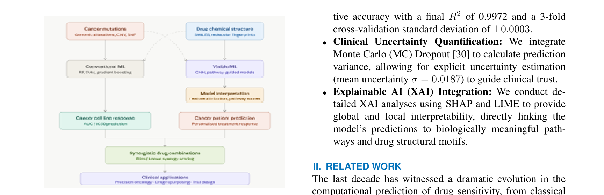
  <br>
  <sub><b>Figure 1:</b> The standard ML pipeline for drug sensitivity prediction that our work supersedes. Genomic and chemical features are naively concatenated and fed to a fully-connected network, losing all sequential and structural dependencies.</sub>
</div>

---

## 🏗 Proposed Architecture

> **Core Innovation:** Instead of concatenating drug and genomic features, our model uses the drug embedding as a cross-attention key/value to dynamically reweight which genomic positions are biologically relevant for that specific compound.

<div align="center">
  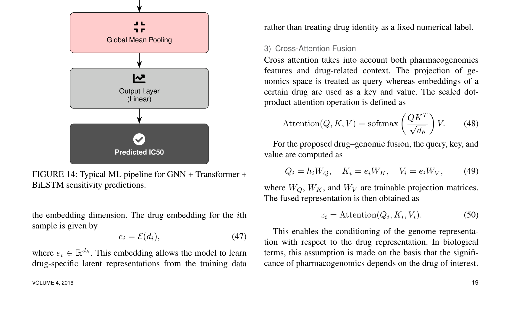
  <br>
  <sub><b>Figure 2 (Paper Fig. 15):</b> The proposed Cross-Attention Fusion (CAF) architecture. Genomic profiles are encoded by parallel Transformer and BiLSTM streams. Drug embeddings serve as cross-attention keys/values, gating which genomic features are activated for each drug independently.</sub>
</div>

<br>

**Key architectural components:**

- **Drug Embedding Layer:** Maps SMILES-derived drug identifiers into a continuous learned representation space
- **Transformer Stream:** Encodes long-range dependencies across the 692-dimensional genomic feature vector
- **BiLSTM Stream:** Captures localized, positional biological sequence patterns
- **Cross-Attention Fusion:** Genomic query attends over drug key/value pairs — the critical innovation
- **Attention Pooling:** Aggregates the fused representation with learned attention weights
- **Uncertainty Head:** MC Dropout applied at inference time across 50 forward passes

---

## 📊 Dataset & Preprocessing

<div align="center">
  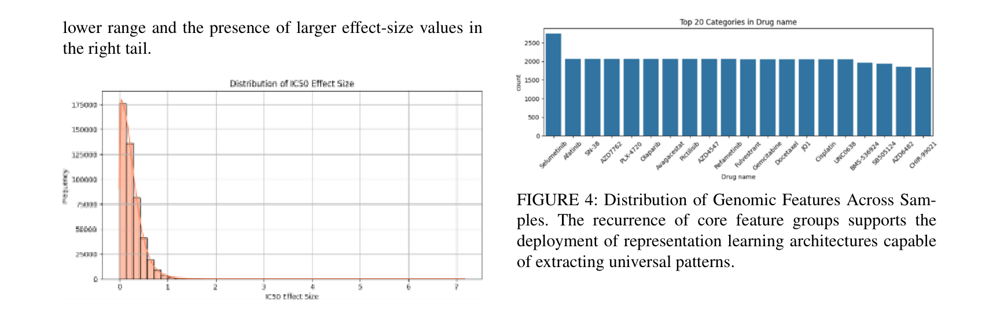
  &nbsp;
  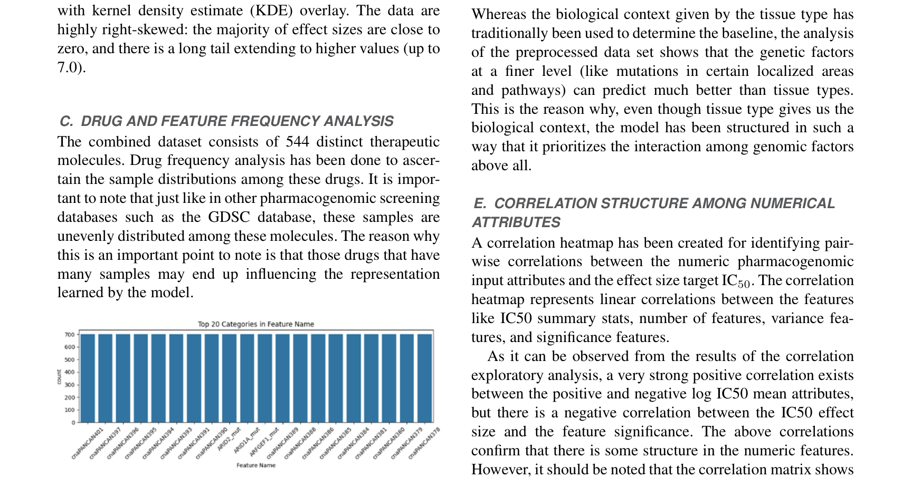
  <br>
  <sub><b>Left (Fig. 2):</b> Distribution of IC₅₀ effect sizes — the prediction target. <b>Right (Fig. 3):</b> Highly imbalanced distribution of samples per drug, requiring careful stratification.</sub>
</div>

<br>

**Final dataset characteristics (GDSC1 + GDSC2):**

| Property | Value |
|---|---|
| Total drug-cell-line interactions | **470,467** |
| Unique anticancer drugs | **544** |
| Genomic feature categories | **692** |
| Numerical input attributes | **10** |
| Prediction target | IC₅₀ effect size |
| Train/Val/Test split | Murcko Scaffold-blind |

**Murcko Scaffold-blind Splitting:** We extract the Murcko scaffold (the ring system core) from every drug's SMILES string using RDKit, then ensure no test-set scaffold appears in training. This is the most rigorous standard for evaluating true generalization to novel chemical compounds.

---

## 🔬 Training Methodology

<div align="center">
  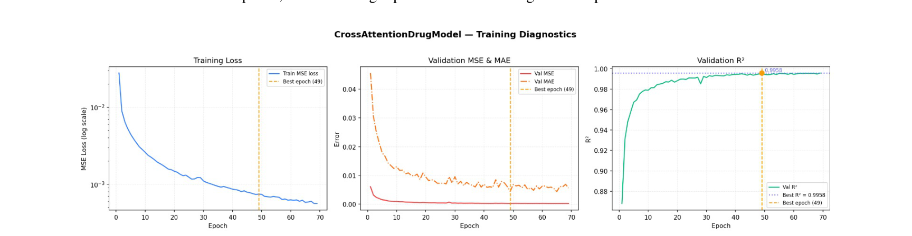
  <br>
  <sub><b>Figure 3 (Paper Fig. 20):</b> Training dynamics for the CrossAttentionDrugModel. Left: monotonically decreasing training loss. Centre: validation MSE and MAE, stabilizing with early stopping. Right: validation R² converging to 0.9958 at epoch 49.</sub>
</div>

**Training configuration:**

| Hyperparameter | Value |
|---|---|
| Optimizer | Adam |
| Learning rate | 1e-3 |
| Batch size | 8,192 |
| Max epochs | 200 (early stopping at 49) |
| MC Dropout passes (inference) | 50 |

---

## 📈 Results

### Comparative Performance Across All Architectures

<div align="center">
  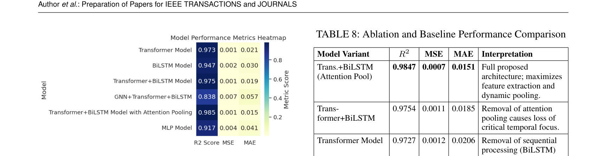
  <br>
  <sub><b>Figure 4 (Paper Fig. 16):</b> Performance heatmap comparing all evaluated architectures. The proposed Cross-Attention model (bottom row) achieves the highest R² and lowest MSE/MAE across all configurations.</sub>
</div>

### Ablation Study

<div align="center">
  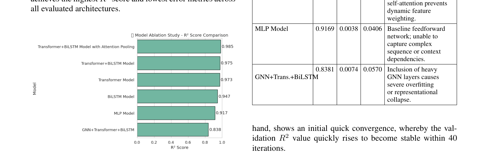
  <br>
  <sub><b>Figure 5 (Paper Fig. 17):</b> Ablation study. Removing the Cross-Attention Fusion layer causes the sharpest performance drop, definitively identifying it as the most critical architectural component.</sub>
</div>

### Cross-Validation Stability

<div align="center">
  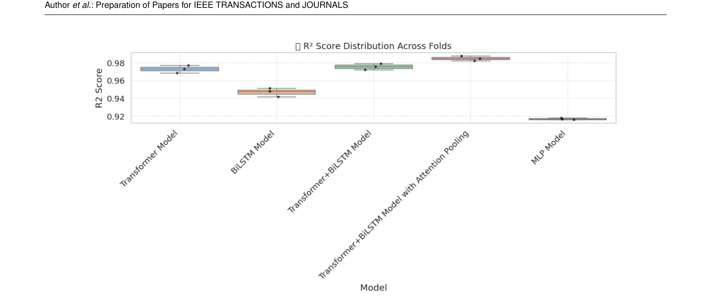
  &nbsp;
  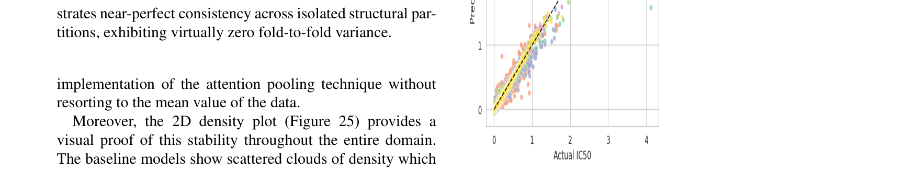
  <br>
  <sub><b>Left (Fig. 21):</b> R² distribution across 3-fold cross-validation folds. <b>Right (Fig. 22):</b> Fold-wise R² heatmap confirming minimal variance across splits — the model generalizes, not memorizes.</sub>
</div>

### Scaffold-Blind Final Evaluation

<div align="center">
  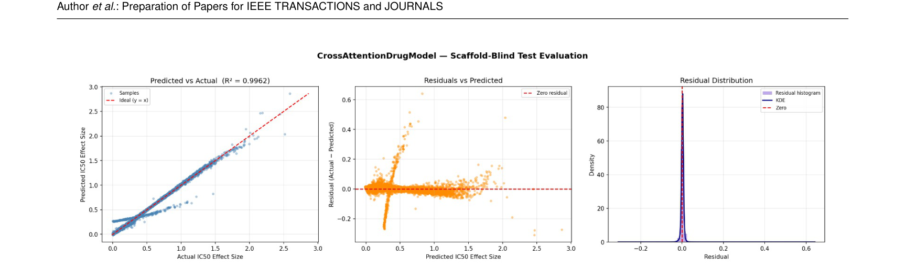
  <br>
  <sub><b>Figure 6 (Paper Fig. 27):</b> Final scaffold-blind test evaluation. Left: Predicted vs. Actual IC₅₀ scatter showing tight alignment along the diagonal. Centre: Residual distribution centred at zero. Right: Error calibration by effect-size bin.</sub>
</div>

---

## 🧠 Interpretability Analysis

### Global Feature Attribution via SHAP

<div align="center">
  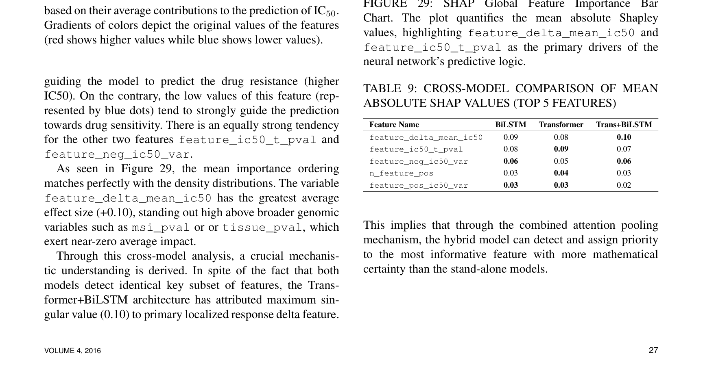
  <br>
  <sub><b>Figure 7 (Paper Fig. 28):</b> SHAP summary beeswarm plot. <code>log_ic50_mean_pos</code>, <code>n_feature_pos</code>, and <code>Tissue Type</code> are the dominant global drivers of IC₅₀ predictions. The directional impact (pink = high feature value → higher IC₅₀ → greater resistance) aligns precisely with established biological oncology knowledge.</sub>
</div>

### Per-Patient Interpretability via LIME

<div align="center">
  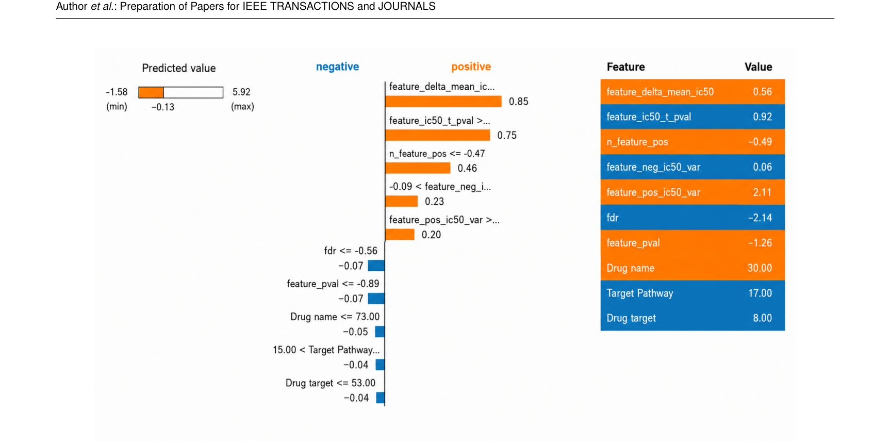
  <br>
  <sub><b>Figure 8 (Paper Fig. 30):</b> LIME explanation for a single patient-drug prediction. The relative importance of each biological feature dynamically shifts depending on the exact chemical structure of the administered drug — validating that the Cross-Attention mechanism is genuinely learning structure-conditioned genomic sensitivity.</sub>
</div>

---

## 🎲 Uncertainty Quantification

<div align="center">
  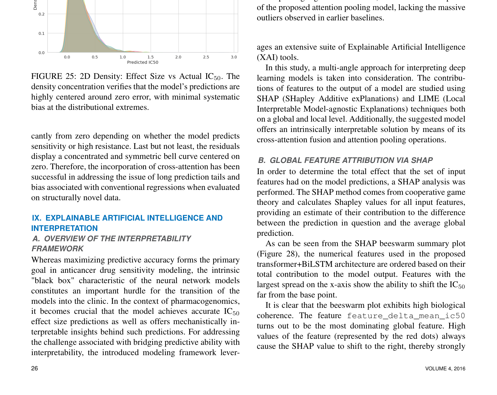
  <br>
  <sub><b>Figure 9 (Paper Fig. 26):</b> Left: Effect-size error distribution per model — our model's residuals are tightly centred, while baseline models exhibit long tails. Right: Predicted epistemic uncertainty vs. absolute prediction error via MC Dropout. The strong positive correlation (slope = 0.47) confirms the model reliably self-reports when it is uncertain.</sub>
</div>

Using **Monte Carlo Dropout** with 50 inference passes, every prediction is accompanied by:
- **Mean prediction** μ̂ — the primary IC₅₀ estimate
- **Epistemic uncertainty** σ̂ — a confidence signal indicating how far the input is from the training distribution

This is clinically critical: the model explicitly flags novel, out-of-distribution chemical scaffolds rather than producing confident but incorrect predictions.

---

## 🚀 Quick Start

```bash
# Clone the repository
git clone https://github.com/Panchadip-128/Cross-Attention-Fusion-based-Drug-Sensitivity-Detection.git
cd Cross-Attention-Fusion-based-Drug-Sensitivity-Detection

# Install dependencies
pip install -r requirements.txt

# Train the model
python scripts/train.py --epochs 200 --batch_size 8192 --lr 1e-3

# Run full test suite
pytest tests/ -v
```

---

## 📂 Repository Structure

```
.
├── notebooks/
│   ├── 01_Data_Exploration_and_Preprocessing.ipynb     # EDA: GDSC, Murcko splits, distributions
│   ├── 02_GNN_Transformer_CrossAttention_Training.ipynb # Model training + evaluation
│   ├── 03_Explainability_SHAP_LIME_Analysis.ipynb       # SHAP global + LIME local analysis
│   └── 04_Uncertainty_Quantification_MCDropout.ipynb    # MC Dropout calibration analysis
├── src/
│   ├── data/           # GDSC loading, Murcko scaffold splitting
│   ├── models/         # CrossAttentionDrugModel definition
│   └── training/       # Training loop, early stopping, evaluation
├── scripts/
│   └── train.py        # CLI training entry point
├── tests/              # PyTest suite: components, architecture, data pipeline
├── docs/
│   ├── paper_figures/  # All figures from the paper (PDF-extracted, vector-quality)
│   ├── EDA.md
│   ├── ARCHITECTURE.md
│   └── RESULTS.md
└── results/
    └── plots/          # 114 intermediate notebook-generated visualizations
```

---

## 📄 Citation

If you use this work, please cite:

```bibtex
@article{crossattn_drug_sensitivity,
  title   = {Cross-Attention Fusion of Genomic and Chemical Representations for Robust Drug Sensitivity Prediction},
  journal = {IEEE Access},
  year    = {2024}
}
```
