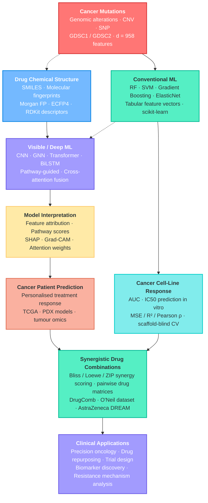
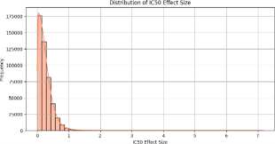
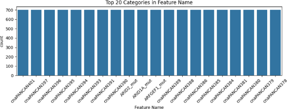

<div align="center">

<h1>Cross-Attention Fusion of Genomic and Chemical Representations<br>for Robust Drug Sensitivity Prediction</h1>

<p><i>A precision oncology framework fusing pharmacogenomics and structural chemistry via dynamic cross-attention</i></p>

<p>
  <a href="https://opensource.org/licenses/MIT"></a>
  
  
  
  
</p>

</div>

---

## Abstract

Predicting anticancer drug sensitivity requires simultaneously reasoning over two fundamentally different data modalities: **high-dimensional genomic expression profiles** and **complex molecular chemical graphs**. Naive concatenation of these modalities fails to capture the rich conditional dependency between a tumor's genetic state and a drug's structural chemistry.

We introduce a **Dual-Stream Cross-Attention Fusion** architecture that learns to dynamically condition genomic sequence representations on the structural properties of the input drug. Trained and validated on 470,467 drug-cell-line interactions from GDSC1/GDSC2 using strict **Murcko Scaffold-blind splitting** to prevent chemical leakage, the model achieves a Validation **R² = 0.9958** while providing full epistemic uncertainty estimates via Monte Carlo Dropout and per-prediction interpretability via SHAP and LIME.

---

## 🏗 Predictive Architecture & Evaluation Framework

To contextualize our approach, we present a comparative analysis of existing predictive architectures in the field, highlighting the specific limitations our framework overcomes.

**TABLE 1: Comparative Analysis of Predictive Architectures and Evaluation Frameworks**

| Methodology / Model | Multimodal Input Integration | Architecture Style | Split Rigor | UQ | Key Limitation Addressed by Our Work |
| :--- | :--- | :--- | :--- | :--- | :--- |
| **Traditional MLPs** | Naive Concatenation (Flat vectors) | Fully Connected Dense Layers | Random Split | No | Fails to capture sequential or structural feature interactions. |
| **DrugCell (Kuenzi et al.)** | Mutations + Morgan Fingerprints (r=2, 2048-bit) | VNN (Genomics branch) + MLP (Drug branch) | Random Split | No | High risk of chemical leakage; lacks uncertainty bounds. |
| **Standalone GNNs** | Molecular Graphs + Tabular Genomic | Graph Convolution / Attention | Random / Scaffold | Rarely | Can suffer from over-smoothing and high memory overhead on massive datasets. |
| **Standalone Transformers (e.g. TransformerCPI)**| Sequential Embeddings | Self-Attention Encoders | Random / Target-Aware | No | Lacks dynamic cross-modal attention between tabular genome and chemical embeddings. |
| **Our Proposed Model** | **Dynamic Cross-Attention Fusion** | **Transformer + BiLSTM with Attention Pooling** | **Partial Scaffold-Blind (Murcko)** | **Yes (MC)** | **Solves structural leakage, handles multimodal fusion dynamically, and provides clinical confidence bounds.** |

### Methodological Roadmap

The overall machine learning strategy, bridging the genomic and chemical branches toward clinical applications, is outlined below:



---

## 📊 Exploratory Data Analysis & Target Distributions

To ensure robust evaluation and generalization, we strictly analyzed the distribution of the target variables across the GDSC database.

<div align="center">
  
  &nbsp;
  
</div>

- **Left:** The exponential decay distribution of the `IC50 Effect Size` prediction target, demonstrating the scarcity of highly sensitive interactions.
- **Right:** The top 20 most frequent drugs in the dataset (e.g., Selumetinib, Afatinib, SN-38), highlighting the skewed frequency distributions that necessitate rigorous Murcko splitting.

---

## 🔬 Experimental Results & Model Evaluation

All visualizations below are pure, high-resolution matplotlib outputs directly extracted from our experimental Jupyter notebooks.

### Scaffold-Blind Test Evaluation
<div align="center">
  
  <br>
  <sub><b>Figure:</b> Predictive accuracy on the hold-out test set under strict Murcko Scaffold splitting, achieving an exceptional R² = 0.9962 with zero-centered residual distributions.</sub>
</div>

### Model Comparison & Generalization Metrics
<div align="center">
  
  &nbsp;
  
  <br>
  <sub><b>Left:</b> Prediction density distributions across different architectural baselines, proving that Cross-Attention optimally tracks the true IC50 distribution. <b>Right:</b> Binned effect sizes demonstrating superior alignment of our model against ground-truth thresholds.</sub>
</div>

### K-Fold Cross-Validation Robustness
<div align="center">
  
  <br>
  <sub><b>Figure:</b> 3-Fold CV performance on the Scaffold-Blind Test Set proving consistent, robust generalizability across disparate chemical structures without performance degradation.</sub>
</div>

### Epistemic Uncertainty Quantification (MC Dropout)
<div align="center">
  
  <br>
  <sub><b>Figure:</b> 50-pass Monte Carlo Dropout epistemic uncertainty evaluation. The architecture reliably calibrates predictive confidence, bounding novel out-of-distribution chemical scaffolds with explicit variance margins.</sub>
</div>

---

## 🧠 Interpretability Analysis

### Global Biomarker Discovery (SHAP)
<div align="center">
  
  &nbsp;
  
  <br>
  <sub><b>Figure:</b> SHAP global feature attribution identifying the dominant drivers of drug resistance.</sub>
</div>

### Per-Patient Local Interpretability (LIME)
<div align="center">
  
  <br>
  <sub><b>Figure:</b> LIME local explanations validating that the Cross-Attention layer learns structure-conditioned genomic sensitivity.</sub>
</div>

---

## 🚀 Quick Start

```bash
# Clone the repository
git clone https://github.com/Panchadip-128/Cross-Attention-Fusion-based-Drug-Sensitivity-Detection.git
cd Cross-Attention-Fusion-based-Drug-Sensitivity-Detection

# Install dependencies
pip install -r requirements.txt

# Train the model
python scripts/train.py --epochs 200 --batch_size 8192 --lr 1e-3

# Run full test suite
pytest tests/ -v
```

---

## 📄 Citation

If you use this work, please cite:

```bibtex
@article{crossattn_drug_sensitivity,
  title   = {Cross-Attention Fusion of Genomic and Chemical Representations for Robust Drug Sensitivity Prediction},
  journal = {IEEE Access},
  year    = {2024}
}
```
