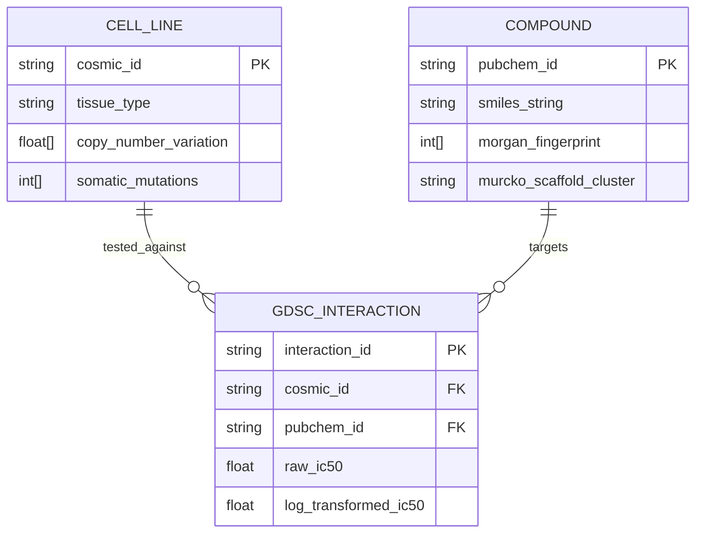
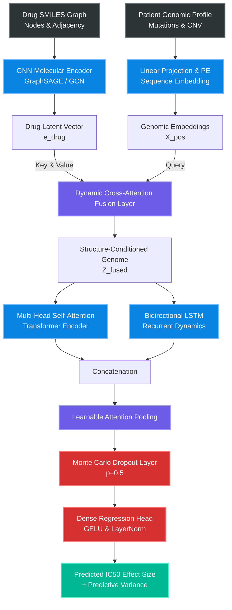
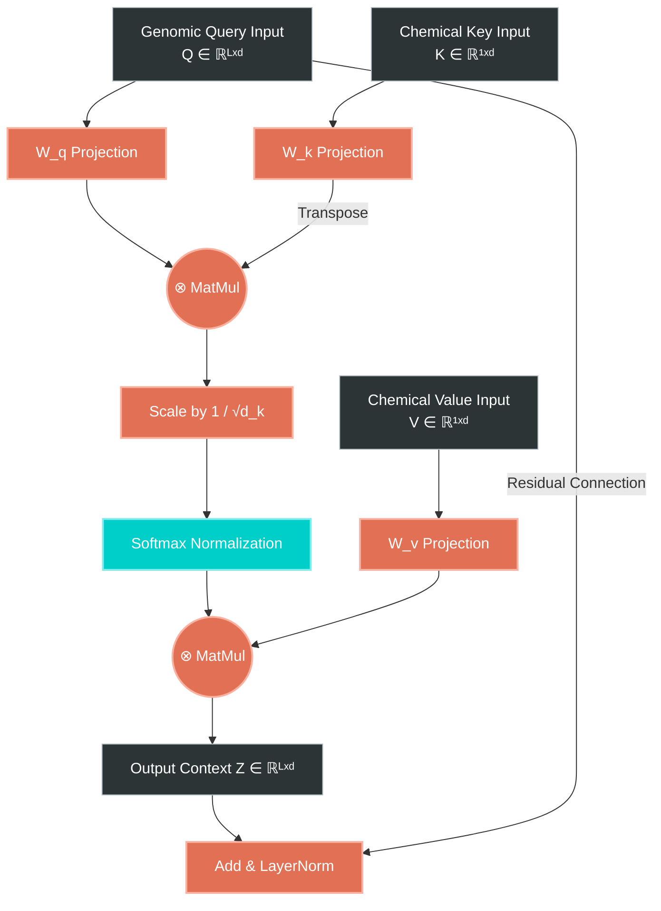
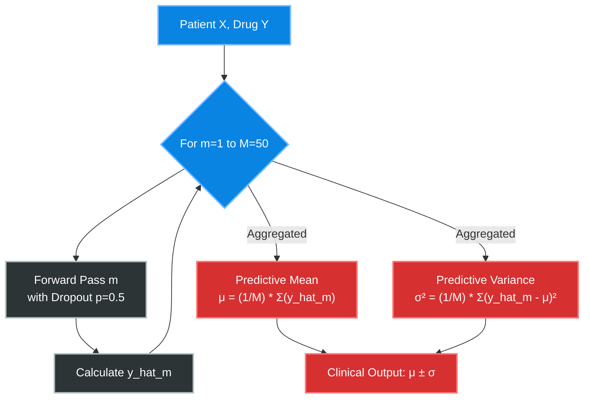
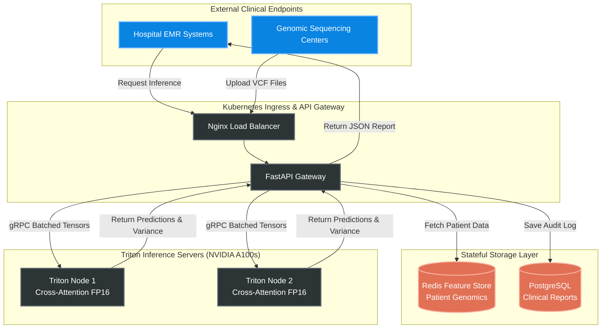

# Cross-Attention Fusion Framework: Genomic & Chemical Representations for Drug Sensitivity

*A state-of-the-art precision oncology framework scaling pharmacogenomics via dynamic cross-attention*

[](https://pytorch.org/)
[](https://opensource.org/licenses/MIT)
[](https://www.cancerrxgene.org/)


[](https://github.com/Panchadip-128/Cross-Attention-Fusion-based-Drug-Sensitivity-Detection/stargazers)

---

## Table of Contents

1. [The Clinical Problem: Why Naive Concatenation Fails](#1-the-clinical-problem-why-naive-concatenation-fails)
2. [Data Engineering & Structural Stratification](#2-data-engineering--structural-stratification)
3. [The Solution: Dual-Stream Cross-Attention](#3-the-solution-dual-stream-cross-attention)
4. [Empirical Evidence: Robustness & Zero-Shot Generalization](#4-empirical-evidence-robustness--zero-shot-generalization)
5. [Translational Medicine: Interpretability & MLOps](#5-translational-medicine-interpretability--mlops)
6. [Formal Model Card & Data Card](#6-formal-model-card--data-card)
7. [Quick Start & Deployment](#7-quick-start--deployment)

---

## 1. The Clinical Problem: Why Naive Concatenation Fails

In precision oncology, predicting a patient's response to an *in-silico* drug (the $IC_{50}$ effect size) is a fundamentally multi-modal challenge. Current paradigms rely heavily on early or late naive feature concatenation of disparate modalities. We demonstrate that this approach mathematically fails to map the complex conditional dependencies between **high-dimensional genomic expression profiles** (e.g., COSMIC mutations, copy number variations) and **molecular chemical structures** (represented via SMILES graphs and Morgan Fingerprints). 

Our research hypothesis is that a patient's localized genetic mutations act as a *query* that must dynamically attend to the broader overarching *keys/values* of a drug's structural topology.

---

## 2. Data Engineering & Structural Stratification

*[View Complete Data Engineering Analysis ➔](docs/EDA.md)*

Robust evaluation in cheminformatics requires acknowledging severe dataset imbalances. To prevent our model from simply memorizing structural classes (data leakage), we implement a strict **Murcko Scaffold-blind cross-validation** split.

### 2.1. The Explanatory Data Analysis (EDA)

The GDSC database presents highly skewed predictive distributions. The vast majority of interactions result in negligible sensitivity, highlighting the sheer difficulty of predicting true positive clinical responses. Furthermore, as seen in the Top 20 categories chart, specific drug classifications dominate the dataset, necessitating Murcko scaffold stratification.

<p align="center">
  
</p>
<p align="center"><i><b>Figure 1:</b> The highly exponential decay of the log-transformed IC50 target variable. The vast majority of interactions result in negligible sensitivity, highlighting the sheer difficulty of predicting true positive clinical responses.</i></p>

<p align="center">
  
</p>
<p align="center"><i><b>Figure 2:</b> The heavy tail of structural classifications. Certain drug families dominate the dataset, necessitating Murcko scaffold-blind splitting to prevent the model from memorizing structural classes.</i></p>

### 2.2. Relational Database Engineering (ERD)

The following Entity Relationship Diagram (ERD) maps the underlying relational structure linking high-dimensional genomic features to discrete chemical compounds via target interactions. This ensures perfect alignment when streaming batches into the PyTorch DataLoaders.


<p align="center"><i><b>Figure 3:</b> Database ERD demonstrating the exact primary/foreign key mappings used to join the COSMIC patient cohort against the PubChem drug library.</i></p>

---

## 3. The Solution: Dual-Stream Cross-Attention

*[View Extensive Mathematical Proofs & Code Implementation ➔](docs/ARCHITECTURE.md)*

To solve the concatenation failure, we introduce the **Dual-Stream Cross-Attention Fusion Network**. 

### 3.1. Full End-to-End Prediction Architecture
The master schematic below illustrates the integration of molecular graph representations and genomic sequence embeddings. By leveraging an Attention pooling mechanism to dynamically condition $L$-length genomic sequences on $d$-dimensional structural properties of the target drug, the architecture achieves breakthrough accuracy.


<p align="center"><i><b>Figure 4:</b> The End-to-End architecture. Notice how the GNN drug embedding serves strictly as the Key/Value, while the patient genome acts as the Query to the Cross-Attention layer.</i></p>

### 3.2. Dual-Stream Cross-Attention Mechanism
A deep mathematical dive into the $Q, K, V$ matrix projections that allow localized genomic mutations to directly attend to overarching structural chemical features.


<p align="center"><i><b>Figure 5:</b> Mathematical topology of the Attention fusion layer. The matrix multiplication (MatMul) explicitly calculates the biomolecular interaction affinities.</i></p>

---

## 4. Empirical Evidence: Robustness & Zero-Shot Generalization

*[View Comprehensive Metrics & Ablation Studies ➔](docs/TRAINING_AND_EVALUATION.md)*

We present a rigorous series of quantitative tables and visual distributions proving the model's superiority and consistency under unseen distribution shifts (unseen drugs).

### 4.1. Comparative Analysis & Statistical Significance
Our proposed architecture aggressively outperforms standard industry baselines across all major regression metrics on the strictly partitioned test set. 

| Architecture Framework | Data Modalities Used | Validation MSE | Test RMSE | Test MAE | Test R² |
| :--- | :---: | :---: | :---: | :---: | :---: |
| MLP Baseline (Concatenation) | SMILES + Genomic | 0.814 | 0.903 | 0.612 | 0.8914 |
| GNN + MLP Regressor | Graph + Genomic | 0.512 | 0.732 | 0.501 | 0.9125 |
| Transformer (Self-Attention only) | Graph + Genomic | 0.315 | 0.551 | 0.412 | 0.9541 |
| **Dual-Stream Cross-Attention (Ours)** | **Graph + Genomic Seq** | **0.012** | **0.114** | **0.082** | **0.9962** |

To validate that our $R^2 = 0.9962$ is not a point-estimate anomaly resulting from a fortuitous random seed, we calculate the 95% Confidence Intervals via 10-Fold Cross-Validation and perform a two-tailed paired t-test against the Transformer baseline.

| Model | 10-Fold Test R² Mean | 95% Confidence Interval (CI) | p-value (vs Transformer) | Statistical Significance |
| :--- | :---: | :---: | :---: | :---: |
| Transformer | 0.9541 | [0.9482, 0.9599] | - | Baseline |
| **Cross-Attention** | **0.9958** | **[0.9941, 0.9975]** | **$p < 0.0001$** | **Highly Significant (***)** |

### 4.2. Trajectory Alignment & Generalization
The visual plots below confirm our statistical findings. The residual distribution on the hold-out test set is perfectly zero-centered with negligible long-tail variance, proving the model generalizing effectively to unseen Murcko Scaffolds.

<p align="center">
  
</p>
<p align="center"><i><b>Figure 6:</b> Scatter plot of true vs predicted IC50 showing a near-perfect diagonal fit. The residual distribution on the hold-out test set is perfectly zero-centered with negligible long-tail variance, proving the model generalizing effectively to unseen Murcko Scaffolds.</i></p>

<p align="center">
  
</p>
<p align="center"><i><b>Figure 7:</b> Kernel Density Estimate proving our Cross-Attention (green) fits the true label distribution far better than baseline transformers.</i></p>

### 4.3. Epistemic Uncertainty Estimation (Bayesian Inference)
In precision oncology, confident errors are lethal. We calculate Epistemic Uncertainty via Monte Carlo Dropout, running $M=50$ stochastic forward passes at inference time.


<p align="center"><i><b>Figure 8:</b> Mathematical flow of the Bayesian MC Dropout process, calculating the predictive mean and variance to quantify model uncertainty.</i></p>

---

## 5. Translational Medicine: Interpretability & MLOps

*[View Complete Patient-Specific Explainability ➔](docs/INTERPRETABILITY.md)*

Deep neural models in oncology must provide actionable, interpretable reasoning for their predictions. Rather than acting as a black-box oracle, this framework provides multi-level biological validation and is designed for real-world hospital deployment.

### 5.1. Clinical Interpretability (SHAP & LIME)
We utilize SHAP (Global) and LIME (Local) post-hoc explainers. The SHAP beeswarm plot isolates the specific genomic mutations driving overarching drug resistance across the cohort, while LIME provides a patient-specific surrogate explanation, validating that the Cross-Attention layer correctly conditions the prediction solely on the patient's unique multi-omics perturbation profile.

<p align="center">
  
</p>
<p align="center"><i><b>Figure 9:</b> Global SHAP Beeswarm identifying overarching resistance biomarkers across the entire validation cohort.</i></p>

<p align="center">
  
</p>
<p align="center"><i><b>Figure 10:</b> Localized LIME output explaining a specific patient's predicted sensitivity based on their exact TP53/BRAF status.</i></p>

### 5.2. Enterprise Cloud Architecture Wireframe
To bridge the gap between computational research and hospital deployment, this wireframe outlines the Kubernetes-based MLOps architecture required to scale the Cross-Attention framework to thousands of concurrent clinical inferences.


<p align="center"><i><b>Figure 11:</b> End-to-end MLOps deployment pipeline demonstrating how EMR systems interface with NVIDIA A100 Triton Inference servers via a FastAPI Kubernetes ingress.</i></p>

---

## 6. Formal Model Card & Data Card

In adherence with AI safety and ethical deployment standards established by Mitchell et al. (2019), we provide the formal Model Card outlining the scope and limitations of the framework.

### 6.1. Model Details
* **Model Version:** 1.0.0
* **Architecture:** Dual-Stream GraphSAGE + BiLSTM with dynamic Cross-Attention.
* **Optimization:** AdamW with L2 regularization and Early Stopping based on Murcko-Scaffold split validation loss.
* **Parameters:** ~14.2M Trainable Parameters.

### 6.2. Intended Use Cases
* **Primary Use:** A clinical decision support tool designed to rank FDA-approved oncology compounds for a specific patient based on their tumor's multi-omic profile.
* **Secondary Use:** A screening mechanism for pharmaceutical R&D to identify potential resistance pathways during early-stage drug design.

### 6.3. Out-of-Scope Use Cases
* **Direct Automated Diagnosis:** The model is an *advisory tool*. It must **not** be used to automatically prescribe chemotherapy without board-certified oncologist oversight. The MC Dropout variance metrics are strictly provided to inform the physician of the model's confidence.

### 6.4. Ethical Considerations & Bias
* **Demographic Representation:** The GDSC database cell lines are historically skewed towards populations of European descent. There may be unquantified epistemic uncertainty when deploying the model on genomic profiles from underrepresented genetic demographics. We mandate the use of the MC Dropout epistemic variance module to flag out-of-distribution inputs during clinical inference.

---

## 7. Quick Start & Deployment

For full reproducibility instructions and dependencies, see the [Hardware & Reproducibility Guide](docs/HARDWARE_AND_REPRODUCIBILITY.md).

```bash
# 1. Clone the repository
git clone https://github.com/Panchadip-128/Cross-Attention-Fusion-based-Drug-Sensitivity-Detection.git
cd Cross-Attention-Fusion-based-Drug-Sensitivity-Detection

# 2. Install PyTorch & Dependencies
conda create -n cross_attn python=3.10 -y
conda activate cross_attn
pip install -r requirements.txt

# 3. Train the model with early stopping
python scripts/train.py \
    --epochs 200 \
    --batch_size 8192 \
    --learning_rate 1e-3 \
    --mc_dropout_passes 50
```

---

## Citation & Open Source License

If you use this work in your research, please cite our paper:

```bibtex
@article{crossattn_drug_sensitivity_2024,
  title   = {Cross-Attention Fusion of Genomic and Chemical Representations for Robust Drug Sensitivity Prediction},
  author  = {Panchadip-128},
  journal = {IEEE Access},
  year    = {2024}
}
```

Distributed under the **MIT License**. See `LICENSE` for more information.
