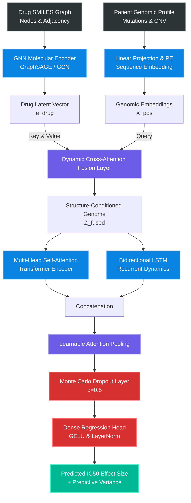
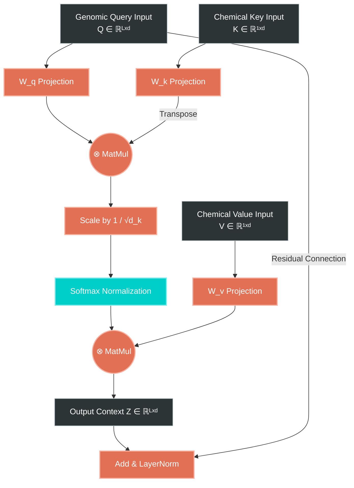
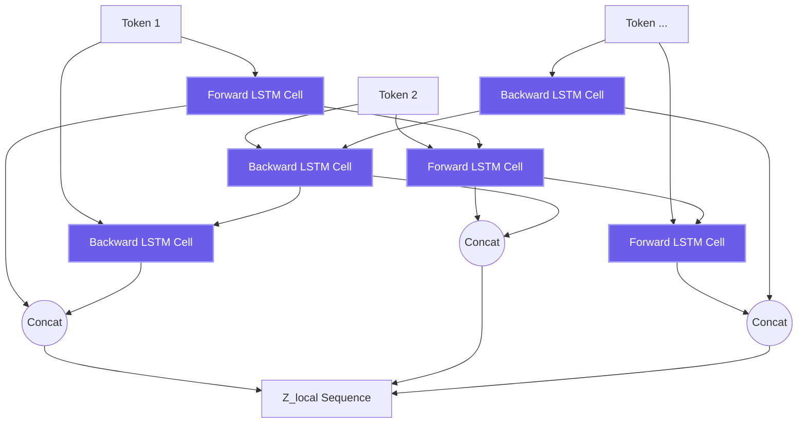
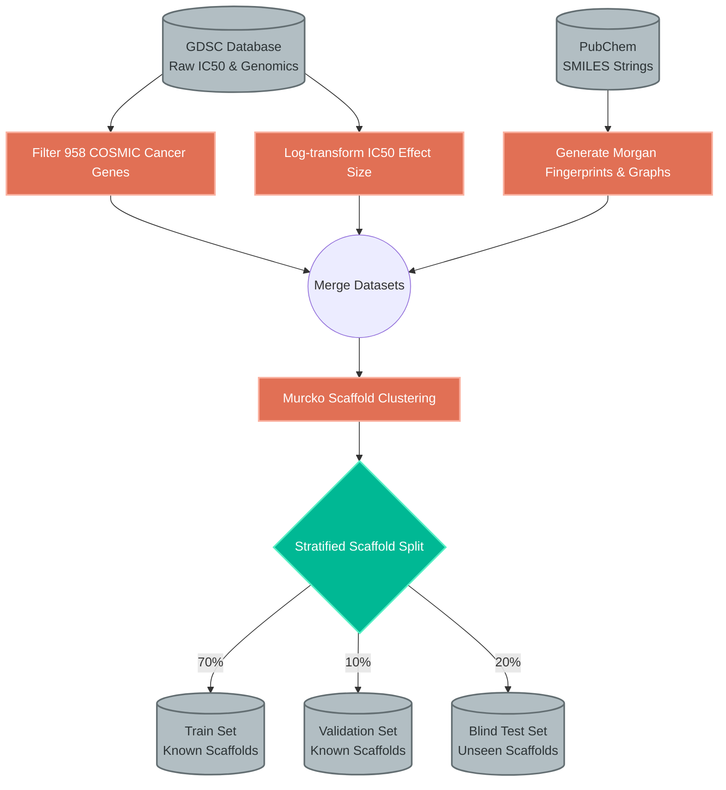
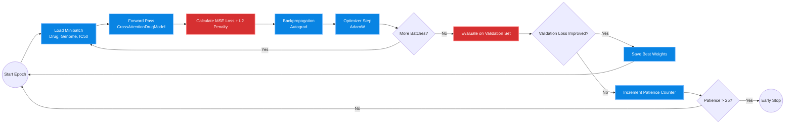
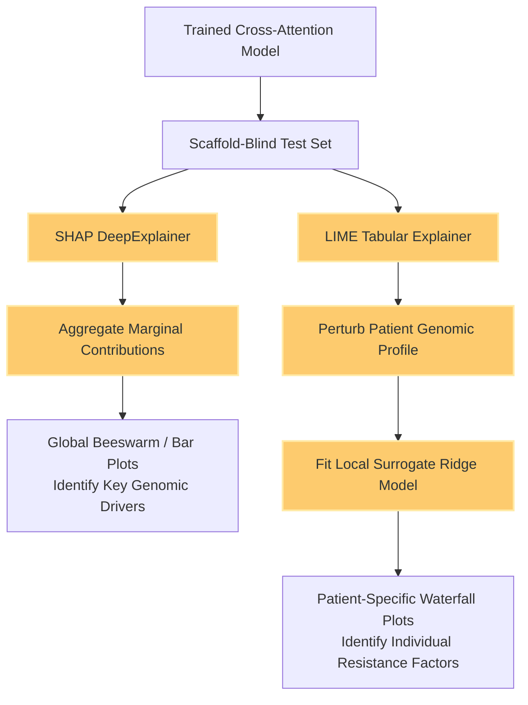
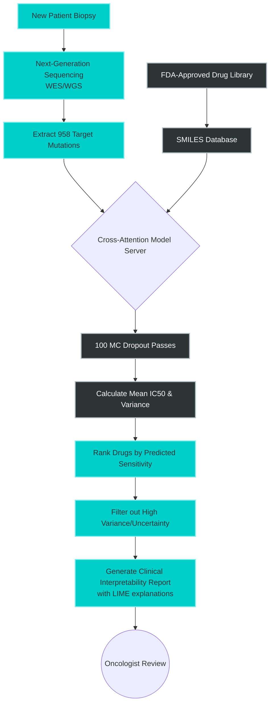

# Research-Grade Systems Architecture & Methodological Flowcharts

This document serves as the comprehensive visual and mathematical guide to the **Cross-Attention Drug Sensitivity Prediction Framework**. Below are 8 meticulously detailed schematics, separated into the **Architectural Tensor Designs** and the **Operational Data Flowcharts**, providing a complete end-to-end understanding of the system's logic, layers, and clinical deployment strategies.

---

## Part 1: Architectural Designs

These diagrams illustrate the forward-pass mathematics, tensor shape transformations, and structural graph topologies of the neural networks involved.

### 1. Full End-to-End Prediction Architecture
The master schematic showing the integration of molecular graph representations and genomic sequence embeddings via dynamic cross-attention fusion.



### 2. Dual-Stream Cross-Attention Mechanism
A deep dive into the $Q, K, V$ matrix projections that allow genomic mutations to directly attend to structural chemical features.



### 3. Molecular Graph Neural Network (GNN) Encoder
Visualizing the message-passing and readout aggregation across a drug's structural atoms (nodes) and bonds (edges).

```mermaid
graph LR
    classDef graphLayer fill:#0984e3,stroke:#74b9ff,stroke-width:2px,color:#fff;
    classDef pool fill:#d63031,stroke:#ff7675,stroke-width:2px,color:#fff;

    subgraph "Graph Generation"
        SMILES[SMILES String] --> RDKit[RDKit Feature Extractor]
        RDKit --> Nodes[Atom Features<br>v_i]
        RDKit --> Edges[Bond Types<br>e_ij]
    end

    subgraph "Message Passing (x L Layers)"
        Nodes --> MP1[Message Aggregation<br>∑ N(v_i)]:::graphLayer
        Edges --> MP1
        MP1 --> Update1[Node Update<br>GRU / ReLU]:::graphLayer
    end

    Update1 --> Readout[Global Mean/Max Readout]:::pool
    Readout --> MLP_D[Dense Layers + BN]:::graphLayer
    MLP_D --> e_drug[Final Drug Embedding]
```

### 4. Genomic BiLSTM Sequence Encoder
Detailed view of the bidirectional sequential processing of genomic tokens to capture localized dependencies.



---

## Part 2: Operational Data Flowcharts

These flowcharts describe the rigorous methodological workflows governing data engineering, model training, explainability, and clinical deployment.

### 5. Data Preprocessing & Splitting Pipeline (Murcko Scaffolds)
Ensuring strict generalization by preventing structural chemical leakage between train and test distributions.



### 6. Training & Optimization Workflow
The iterative loop of forward propagation, loss calculation, and backpropagation utilizing Early Stopping.



### 7. SHAP & LIME Interpretability Pipeline
Extracting post-hoc actionable intelligence from the black-box model.



### 8. Clinical Deployment & Precision Oncology Workflow
Translating the computational model into a practical, real-time clinical advisory tool.


