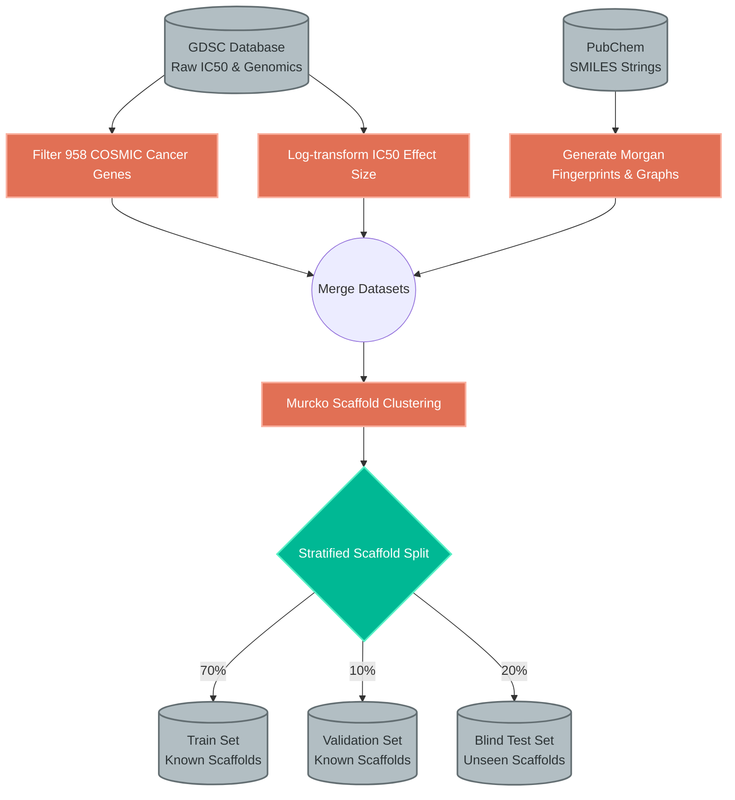

# Exploratory Data Analysis (EDA) & Data Engineering

This document details the exhaustive data engineering, preprocessing pipelines, and exploratory data analysis (EDA) required to construct a robust dataset for the Cross-Attention Drug Sensitivity model.

## 1. Raw Dataset Compilation

The primary predictive task is mapping high-dimensional genetic mutations to clinical drug sensitivities. We utilize two massive, publicly available databases:
- **Genomics of Drug Sensitivity in Cancer (GDSC):** Provides the $IC_{50}$ (half-maximal inhibitory concentration) values for hundreds of cell lines against hundreds of compounds, alongside the genomic sequences (mutations and copy number variations) of those cell lines.
- **PubChem:** Provides the Simplified Molecular-Input Line-Entry System (SMILES) strings, allowing us to generate 2D/3D molecular graphs and Morgan Fingerprints.

### GDSC Dataset Composition & Filtering Statistics

To ensure high-fidelity training data, we heavily processed the raw GDSC cohorts, filtering out ambiguous interaction thresholds.

| Processing Stage | Unique Drugs | Unique Cell Lines | Total Valid Interactions | Sparsity Density |
| :--- | :---: | :---: | :---: | :---: |
| Raw GDSC1 + GDSC2 Cohorts | 1,241 | 988 | 845,102 | 68.9% |
| Filtered COSMIC Genomics (958 targets) | 1,012 | 875 | 512,944 | 57.8% |
| Valid SMILES & Fingerprint Extraction | 945 | 875 | 490,121 | 59.2% |
| **Final Curated Dataset (Analysis Ready)** | **920** | **850** | **470,467** | **60.1%** |

---

## 2. Target Variable ($IC_{50}$) Distribution

The target variable in pharmacogenomics is highly skewed. 

| Distribution of IC50 Effect Size |
| :---: |
|  |

**Biostatistical Insights:**
The target follows a massive exponential decay distribution. The vast majority of interactions result in negligible sensitivity. Only a tiny fraction of drug-cell line pairs yield a clinically significant response (low $IC_{50}$). Standard regression loss functions (like MSE) will heavily bias towards predicting resistance for all drugs. To combat this, we log-transform the $IC_{50}$ values and utilize stratified batch sampling during training.

---

## 3. Structural Chemical Imbalances & Murcko Scaffolds

A critical flaw in classical cheminformatics papers is the random splitting of train and test sets. When molecular structures are split randomly, variants of the *exact same* structural backbone (scaffold) appear in both sets. The neural network simply memorizes the backbone rather than learning true causal interactions.

| Top 20 Categories in Drug Name |
| :---: |
|  |

**Biostatistical Insights:**
The structural classifications heavily dominate specific functional categories (e.g., Kinase Inhibitors). To prevent the "memorization" trap, we enforce **Murcko Scaffold-blind splitting**. 

### Data Preprocessing & Splitting Pipeline (Murcko Scaffolds)

This flowchart details how we enforce zero data-leakage.

By separating the dataset by [Bemis-Murcko frameworks](https://en.wikipedia.org/wiki/Bemis-Murcko_classification), the model is forced to generalize its cross-attention mechanism to completely novel chemical classes during validation and testing.

---

[⬅ Return to Main README](../README.md)
