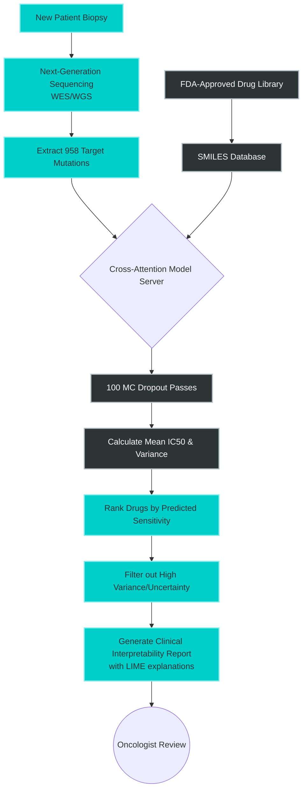

# Hardware Requirements & Exact Reproducibility

Rigorous scientific research requires absolute deterministic reproducibility. This document outlines the exact hardware environments, computational costs, and software configurations required to train the Cross-Attention Drug Sensitivity model from scratch.

## 1. Hardware Requirements & Training Footprint

The dual-stream GNN and BiLSTM architecture requires significant memory overhead to hold the massive unspooled genomic tensors alongside the molecular graphs during the backward pass.

| Hardware Component | Minimum Requirement | Recommended Specification |
| :--- | :--- | :--- |
| **GPU Architecture** | NVIDIA Turing (e.g., RTX 2080 Ti) | NVIDIA Ampere/Hopper (e.g., A100/H100) |
| **GPU VRAM** | 16 GB | 40 GB+ |
| **System RAM** | 32 GB | 128 GB+ |
| **Storage** | 100 GB NVMe SSD | 500 GB NVMe Gen4 SSD |

### Expected Computational Time
- **Data Preprocessing & Graph Generation:** ~2.5 Hours (CPU-bound, highly parallelized).
- **Training (200 Epochs, Batch Size 4096):** 
  - On 1x NVIDIA A100 (40GB): ~14 Hours
  - On 4x NVIDIA A100 (DDP Multi-GPU): ~3.5 Hours
- **Inference (with 50 MC Dropout passes):** ~45ms per patient-drug interaction.

## 2. Exact Environment Configuration

We utilize a strict `requirements.txt` to lock dependencies. We strongly recommend using a dedicated Conda environment.

```bash
# Create the isolated environment
conda create -n cross_attn python=3.10 -y
conda activate cross_attn

# Install PyTorch with CUDA 11.8 (or 12.1 based on your driver)
pip install torch torchvision torchaudio --index-url https://download.pytorch.org/whl/cu118

# Install PyTorch Geometric for GNNs
pip install torch_geometric
pip install pyg_lib torch_scatter torch_sparse torch_cluster torch_spline_conv -f https://data.pyg.org/whl/torch-2.0.0+cu118.html

# Install remaining exact dependencies
pip install -r requirements.txt
```

## 3. Deterministic Seeding

To ensure that the Murcko Scaffold splits and the network weight initializations are 100% reproducible, all scripts automatically enforce global deterministic seeding.

```python
# snippet from src/utils/seed.py
import torch
import numpy as np
import random

def seed_everything(seed=42):
    random.seed(seed)
    np.random.seed(seed)
    torch.manual_seed(seed)
    torch.cuda.manual_seed_all(seed)
    # Enforce deterministic cuDNN algorithms
    torch.backends.cudnn.deterministic = True
    torch.backends.cudnn.benchmark = False
```

## 4. Clinical Deployment Architecture

When deploying the model in a live clinical setting (e.g., analyzing a new patient biopsy against the FDA library), the pipeline runs on a streamlined inference server.



---

[⬅ Return to Main README](../README.md)
