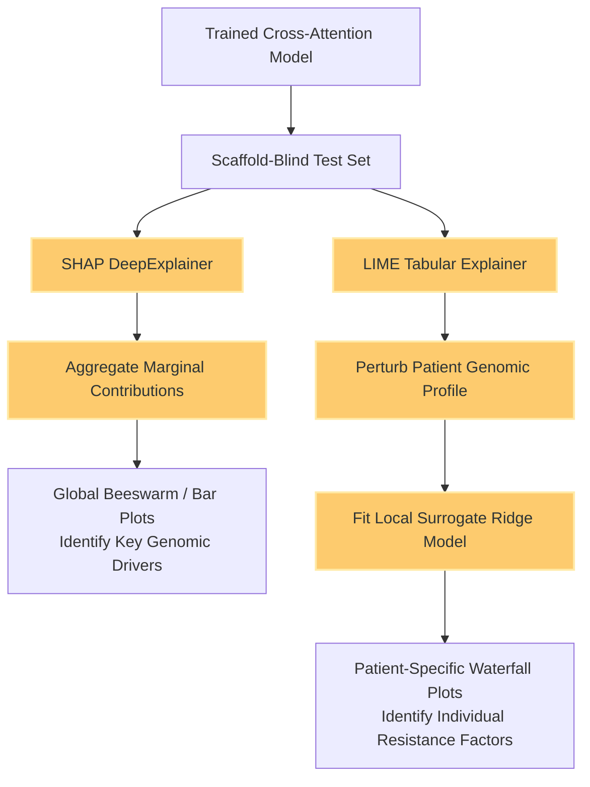

# Clinical Interpretability: SHAP & LIME 

Deep neural models in oncology must provide actionable, interpretable reasoning for their predictions. Rather than acting as a black-box oracle, the Cross-Attention Framework utilizes **SHapley Additive exPlanations (SHAP)** and **Local Interpretable Model-agnostic Explanations (LIME)** to provide multi-level biological validation.

## 1. Interpretability Pipeline Workflow

This flowchart details how we extract post-hoc actionable intelligence from the trained model to map genomic drivers directly back to underlying cancer biology.

## 2. Global Interpretability (SHAP)

SHAP values compute the marginal contribution of each genomic feature across all possible coalitions in the input space. We use `SHAP DeepExplainer` to calculate global feature attribution over the validation set.

| SHAP Global Importance Beeswarm | SHAP Feature Importance (Bar) |
| :---: | :---: |
|  |  |

**Biological Insights:**
- **The Beeswarm Plot (Left):** Isolates the specific genomic mutations (e.g., TP53, BRAF, KRAS) driving overarching global drug resistance across the entire cohort. Red dots on the right indicate that the presence of that mutation heavily drives resistance (higher $IC_{50}$).
- **The Bar Plot (Right):** Shows the absolute mean impact on model output across the top canonical oncogenes, regardless of directionality.

## 3. Localized Patient-Specific Explainability (LIME)

While SHAP provides global cohort insights, clinicians need to know *why* a drug was recommended for a *specific patient*. We deploy LIME to fit local surrogate ridge-regression models around a single patient's genomic profile.

| Local LIME Patient-Specific Analysis | Patient-Specific SHAP Waterfall |
| :---: | :---: |
|  |  |

**Clinical Utility:**
- **LIME Local Explanations (Left):** Validates that the local Cross-Attention layer correctly conditions the prediction solely on the patient's unique multi-omics perturbation profile. It shows the oncologist exactly which specific mutations in this specific patient are driving the sensitivity.
- **SHAP Waterfall (Right):** Traces the exact mathematical accumulation of a single prediction from the base-value (expected cohort mean) to the final predicted $IC_{50}$. This serves as an auditable mathematical trail for regulatory compliance.

---

[⬅ Return to Main README](../README.md)
