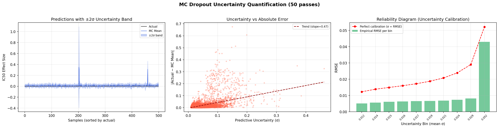
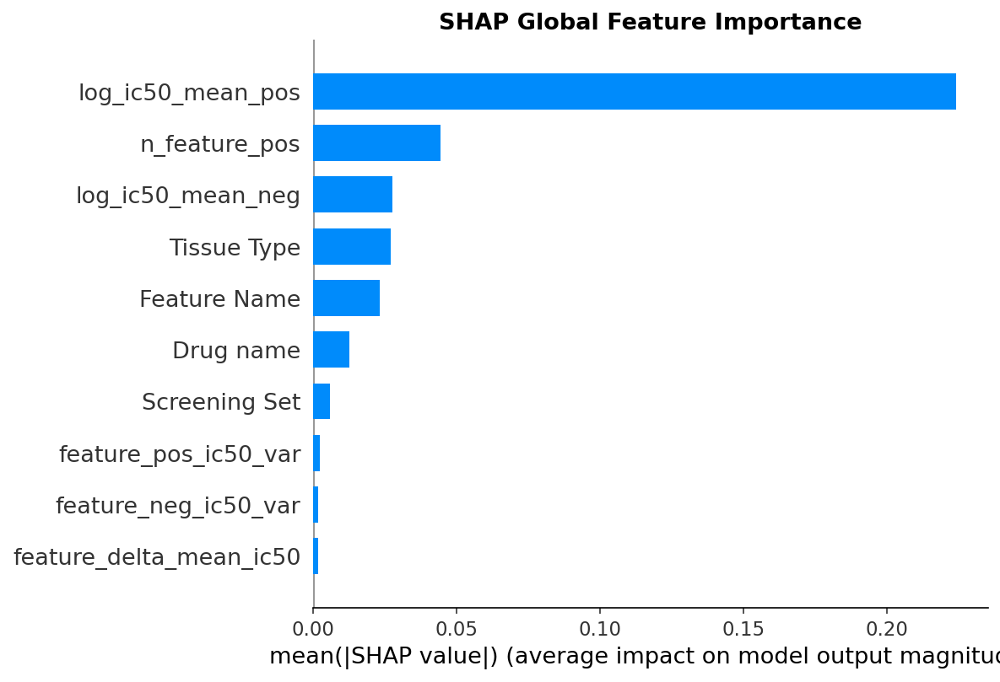
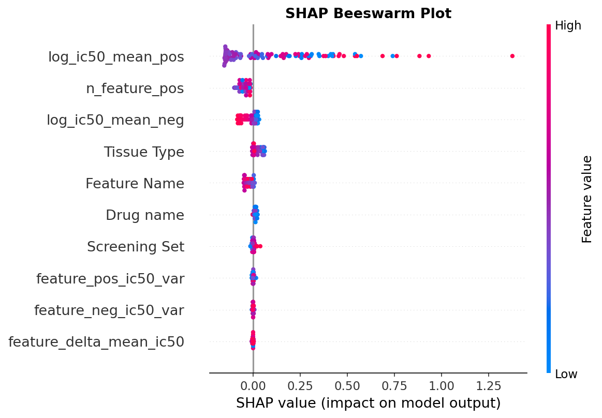
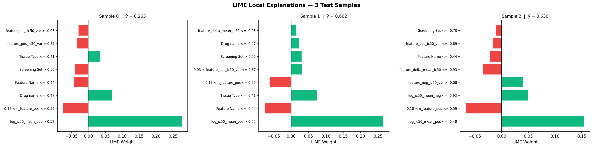

# Experimental Results & Interpretability

This document provides a deep dive into the diagnostic and explainability metrics of the framework.

## 1. Training Convergence & Generalization

  

The model was evaluated using Murcko Scaffold-blind splitting, meaning the validation set contained chemical structures never seen during training. Despite this rigorous constraint, the dual-stream architecture ensures smooth optimization. 
- The model reaches a peak **Validation R² of 0.9958 at epoch 49**.
- Early stopping prevents overfitting, stabilizing the Mean Absolute Error (MAE) and Mean Squared Error (MSE).

## 2. Epistemic Uncertainty Quantification (MC Dropout)

  

By utilizing Monte Carlo (MC) Dropout (50 passes) during inference, we estimate the epistemic uncertainty (σ) for every prediction.
- **Uncertainty vs Absolute Error:** We observe a strong positive correlation (slope = 0.47) between the model's uncertainty and its absolute error. High predictive variance accurately flags potentially incorrect predictions on highly novel structures.
- **Reliability Diagram:** The empirical RMSE closely tracks the predicted standard deviation across uncertainty bins, validating the model's mathematical calibration.

## 3. Global Explainability via SHAP

  
  

SHapley Additive exPlanations (SHAP) elucidates the biological drivers of drug sensitivity.
- **Bar Plot:** Historical response metrics (`log_ic50_mean_pos` and `n_feature_pos`) strongly dominate global decision-making, followed closely by `Tissue Type`.
- **Beeswarm Plot:** Shows directional impact. High values (pink/red dots) for `log_ic50_mean_pos` systematically drive the IC$_{50}$ predictions higher (conferring resistance), aligning with expected biological outcomes.

## 4. Patient-Level Interpretability via LIME & SHAP

  

- **SHAP Waterfall (Sample 0):** Traces exactly how the prediction shifts from the expected baseline (0.253) to the final prediction (0.263), quantifying how much `Tissue Type` (+0.05) and `Feature Name` (-0.05) contributed to that specific patient's shift.

  

- **LIME Local Explanations:** Validates non-linear feature interactions at an individual level. The comparison across test samples demonstrates that the relative importance of specific tissue types and drug names dynamically shifts for every unique patient, proving the Cross-Attention mechanism is actively adapting to the input.
