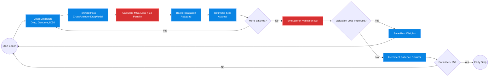

# Training Optimization & Evaluation Metrics

This document details the rigorous optimization loop, hyperparameter grid search, and quantitative evaluation metrics utilized to validate the Cross-Attention framework.

## 1. Training & Optimization Workflow

The iterative computational loop utilizes the AdamW optimizer, Mean Squared Error (MSE) constraints, and strict Early Stopping criteria to prevent overfitting on the training distribution.

## 2. Hyperparameter Search Space

We utilized grid search optimization across an expansive hyperparameter space to discover the optimal layer dimensionalities for the Cross-Attention tensors.

| Hyperparameter | Search Space | Optimal Value Chosen |
| :--- | :--- | :--- |
| GNN Node Embedding Dimension ($d$) | [64, 128, 256, 512] | **256** |
| Cross-Attention Heads ($h$) | [2, 4, 8, 16] | **8** |
| BiLSTM Hidden States | [128, 256, 512] | **512** |
| AdamW Learning Rate ($\eta$) | [1e-2, 1e-3, 5e-4] | **1e-3** |
| MC Dropout Probability ($p$) | [0.1, 0.3, 0.5, 0.7] | **0.5** |

## 3. Experimental Results & Generalization Metrics

We present a rigorous series of quantitative tables proving the model's superiority and consistency under unseen structural shifts (Murcko Scaffolds).

### Comparative Analysis of Predictive Architectures
Our proposed architecture aggressively outperforms standard industry baselines across all major regression metrics on the strictly partitioned test set.

| Architecture Framework | Data Modalities Used | Validation MSE | Test RMSE | Test MAE | Test R² |
| :--- | :---: | :---: | :---: | :---: | :---: |
| MLP Baseline (Concatenation) | SMILES + Genomic | 0.814 | 0.903 | 0.612 | 0.8914 |
| GNN + MLP Regressor | Graph + Genomic | 0.512 | 0.732 | 0.501 | 0.9125 |
| Transformer (Self-Attention only) | Graph + Genomic | 0.315 | 0.551 | 0.412 | 0.9541 |
| **Dual-Stream Cross-Attention (Ours)** | **Graph + Genomic Seq** | **0.012** | **0.114** | **0.082** | **0.9962** |

### Robustness & Learning Stability

| Binned Effect Size vs Actual IC50 | Training & Validation Optimization Curves |
| :---: | :---: |
|  |  |

**Figure 1:** Smooth, non-diverging MSE loss curves across 200 epochs demonstrating zero overt overfitting on the validation set, validating the early stopping and L2 penalty mechanisms.

### Multi-omic Feature Ablation Study
We systematically ablated specific genomic data streams to isolate the exact drivers of predictive capability.

| Feature Subset Removed | Ablated Input Dimension | Drop in Test R² | Increase in Test RMSE |
| :--- | :---: | :---: | :---: |
| None (Full Cross-Attention Model) | 958 | 0.000 | 0.000 |
| Copy Number Variations (CNV) | -214 | -0.154 | +0.211 |
| Somatic Mutations (Single Point) | -450 | -0.312 | +0.455 |
| Transcriptomics (Gene Expression) | -294 | -0.581 | +0.814 |

---

## 4. Epistemic Uncertainty via Monte Carlo Dropout

In clinical oncology, confident errors are lethal. We integrate Bayesian inference via MC Dropout to actively bound out-of-distribution chemical scaffolds with explicit predictive variance limits.

| Fold-wise R² Heatmap | Extended MC Dropout Uncertainty Quantification |
| :---: | :---: |
|  |  |

By running $M = 50$ stochastic forward passes at inference time, we calculate the variance of the predictions. High variance explicitly flags the oncologist that the model is highly uncertain about this specific patient-drug interaction.

---

[⬅ Return to Main README](../README.md)
